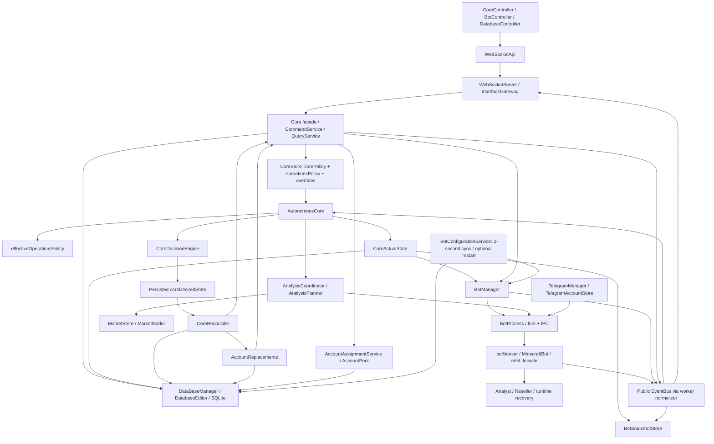

# Afina architecture audit — current implementation

> **Phase 5 update — 2026-09-26:** [Lifecycle arbitration and graceful stopping](core-v2-phase5.md) now uses the shared action ledger, durable recovery state (schema v11), correlated quiescence, and truthful lifecycle settings/diagnostics. Historical lifecycle limitations below describe their original delivery. Autonomous Reseller trading remains disabled.

> **Phase 3 action addendum — 2026-09-25:** [Durable actions/shared accounting](core-v2-phase3.md) now supply operational pending authority, resource claims and transactional generation receipts. Migrated dispatch yields without awaiting full asynchronous completion. Schema v10 is additive. Whole-controller bounds, supervisor arbitration and safe Reseller stops remain open; historical findings below are retained.

> **Phase 2 observation addendum — 2026-09-25:** [The observation report](core-v2-phase2.md) supersedes the findings about event-only Core facts. Core now uses bounded active worker queries, OS/child process evidence, incarnation validation and immutable semantic capacity projections. Lost readiness and silent disappearance are detected without events. This does not resolve action ownership, unbounded executor awaits, safe stops or supervisor recovery arbitration. Historical evidence below is retained.

> **Implementation addendum — Phase 1 completed, 2026-09-25:** The audit below is preserved as pre-Phase-1 evidence. Canonical Operations authority, explicit legacy adapters, shared generation/replacement policy, truthful capabilities and UI are now implemented in SQLite v9. See [current implementation, tests, migration rules and remaining conflicts](core-v2-phase1.md). Observation freshness, action coordination and supervisor ownership findings remain open for Phases 2–7.

Audit date: 2026-09-25. This document describes inspected code, not intended behavior in older documentation. No production changes or live database migrations were performed. The target design and rollout are in [Core v2 proposal](core-v2-proposal.md) and [migration plan](core-v2-migration-plan.md).

## Evidence and scope

Inspected the main composition root, Core, policies, storage/schema/migrations, command/query gateway, browser controllers, account assignment/generation, process supervisor, worker lifecycle, incidents, role runtimes, market analysis, and Telegram coordination. No applicable AGENTS.md was found. This workspace has no visible `.git` directory, so findings identify paths and symbols rather than a commit hash. Existing live databases, credentials, logs, and external Minecraft/Telegram services were not used as evidence of runtime success.

Evidence references below resolve relative to this document:

| Key | Source and significant symbols |
|---|---|
| A | [autonomousCore.js](../src/core/autonomousCore.js): `start`, `schedule`, `drain`, `cycle`, `settlePending`, `snapshot`, policy/override update methods |
| D | [coreDecisionEngine.js](../src/core/coreDecisionEngine.js): `evaluate` |
| R | [coreReconciler.js](../src/core/coreReconciler.js): `plan`, `planAnalysts`, `planAccountGeneration`, `apply` |
| O | [operationsPolicy.js](../src/core/operationsPolicy.js): defaults, validators, `effectiveOperationsPolicy`, `findNextTransition` |
| S | [coreStore.js](../src/core/coreStore.js): policies, revisions, desired document, controls, journal |
| X | [coreActualState.js](../src/core/coreActualState.js): `read` |
| B | [botManagerMain.js](../src/botManager/botManagerMain.js): lifecycle, heartbeat/crash/reconnect methods |
| P | [botProcess.js](../src/botManager/botProcess.js): `start`, `stop`, `isRunning`, message/exit handlers |
| C | [commandService.js](../src/core/commandService.js): handlers, `execute`, `#startBot`, lifecycle/account commands |
| G | [dataBaseManagerMain.js](../src/data/dataBaseManagerMain.js): `createGeneratedAccounts`, `assignAvailableAccount`, `getConfigurationSnapshot` |
| Q | [accountReplacements.js](../src/core/accountReplacements.js): `plan`, `apply`, `available`, `update` |
| F | [botConfigurationService.js](../src/botManager/botConfigurationService.js): `refresh`, `prepare`, `scheduleRestart` |
| M | [analysisCoordinator.js](../src/core/market/analysisCoordinator.js): `restore`, `handle`, `reconcile`, `finish` |
| U | [coreController.js](../src/webTerminal/public/js/coreController.js): forms, `savePolicy`, `saveOperations`, summaries |
| DB | [databaseSchema.js](../src/data/databaseSchema.js): schema v8, upgrades, revision/change tracking; [databaseStore.js](../src/data/databaseStore.js): SQLite transactions |

Validation: `node --test --test-isolation=none tests/coreFoundation.test.js tests/operationsAutomation.test.js tests/operationsAccountGeneration.test.js tests/marketIntelligence.test.js tests/runtimeIncidents.test.js` passed **107/107**. Fixtures use temporary databases and mocked execution. They do not prove live convergence, loss of worker IPC recovery, or enforcement of all Operations settings. In particular, `marketIntelligence.test.js` explicitly asserts production Reseller launches are blocked. Foundation tests inject foundation engines and therefore exercise a different capability configuration.

Additional read-only, in-memory probes against O/R confirmed: role autoStart=false still produces a planned assign_analyst; maintenance-style disabled policy produces blocked stop_analyst; one eligible account bound to a stopped bot can still produce a request for one new account; persisted global target 0 becomes effective target 1 when the role target is 1 within the global maximum. These probes did not instantiate services, open databases, or execute actions. Documentation checks found every one of the 43 Core descriptors, six override descriptors and default Operations leaf fields in the settings inventory, and no broken local links across the four deliverables.

## Findings that determine the redesign

1. **Operations is partly a settings shell.** Transition limits, stability, recovery and health fields, and role autoStart/autoReplace/stopMode are validated and displayed but not enforced. Maintenance makes `policy.enabled=false`, so ordinary reconciliation cannot perform the safe stops promised by the UI. BotManager uses independent hard-coded restart rules.
2. **Policy authority is split.** Operations becomes authoritative for capacity after its document differs from `{}`, but legacy writes still overwrite it. Analysis event handling and snapshot status still consult legacy `corePolicy.enabled`. Replacement permissions and total-account ceilings remain separate from reserve-generation permissions and ceilings.
3. **Operational capacity depends on an unfinished trading path.** Production installs an available AnalysisPlanner; R then adds `TRADING_EXECUTION_DISABLED` to every ordinary Reseller assign/release. Desired role capacity is still the configured target. Replacement has a separate path that can start Resellers. Account generation can run for capacity that the ordinary lifecycle planner cannot fulfill.
4. **Observation is current only within the supervisor's knowledge.** X rereads BotManager each cycle, but P defines running as `Boolean(this.process)` and status/readiness are event-derived. Normal role counting requires Minecraft `running`, not `workReady`; only replacements require readiness. Healthy heartbeats do not refresh semantic worker facts.
5. **Transitions lack one lifecycle authority.** Core pending assignments, supervisor reconnects, configuration restarts, replacement rows and generation counters overlap. Pending assignment timeout clears a journal/control record without cancelling supervisor intent. A hung awaited apply can block all subsequent Core passes. Action signatures are diagnostic deduplication, not durable idempotency.

## Current component/data-flow map

`src/main.js` initializes DB (including migrations during normal application startup), pools, image solver, BotManager definitions, configuration service, assignment and Telegram services, Core and Web UI; it then awaits `core.start()`. `coreMain.js` is a command/query facade plus AutonomousCore composition, not a second autonomous planner. Config, schedule wakeups, manual holds, database notifications and worker events enter A. SQLite triggers increment revisions but do not themselves publish EventBus events.

There is no separate CorePolicyStore, OperationsPolicyStore, or general AccountStore class: S owns both policies; G/DatabaseStore own Minecraft account rows; AccountPool and AccountAssignmentService manage eligibility/binding. TelegramAccountStore is a distinct credential/session store. AccountManager is presently a dependency-holder shell.

## Decision ownership matrix

An asterisk marks competing authority or inconsistent representations. “Events” names feedback; it does not imply every event has a dedicated handler. Readers include UI snapshot/query consumers in addition to those shown. Writer and executor are distinguished even when the same module does both.

| Decision | Owner / writers | Readers | Side-effect executor | Persisted source | Runtime source / events | Competing owner or gap |
|---|---|---|---|---|---|---|
| Core enabled* | A.updatePolicy / S | A, M, U | R, M | corePolicy.enabled | A effective policy; core.policy.updated | Operations switch overrides cycle; M.handle and snapshot still use legacy flag |
| Operations enabled* | A.updateOperationsPolicy / legacy compatibility | A, O | R | operationsPolicy.document.automationEnabled | automationActive; core.operations.updated | legacy switch; keepStopped latch |
| Maintenance* | Operations update | O, A, R | R gates execution | maintenanceMode | policy disabled; operations update | no managed drain; supervisor reconnect remains possible |
| Analyst number* | O role target then D | R, M | R.assign_analyst | roles.analyst.target / legacy targetAnalysts | desired.roles.analyst | legacy writes; supervisor per-bot intent |
| Reseller number* | O role target then D | R, Q | assign/release or replacement | roles.reseller.target / targetResellers | desired.roles.reseller | trading gate, workload allocation, supervisor intent |
| Role minimum | Operations writer/O clamps | diagnostics | none prioritizing recovery | roles.*.minimum | effective minimum | no health-boundary behavior |
| Role target | O, D | R, generation | R | roles.*.target | effective target | legacy mirror write |
| Role maximum | O | D via target | indirect target cap | roles.*.maximum | effective envelope | does not independently enforce running ceiling |
| Global min/target/max* | Operations writer/O | U, A | target clamp only | capacity.* | effective target=sum role targets | persisted global target ignored; minimum inert |
| Role enabled | O | A/D | indirect zero target | roles.*.enabled | schedule may override | disabled Resellers not safely stopped |
| Schedule | O, A clock | A | ordinary R | schedules/timezone | nextTransition / SCHEDULE_TRANSITION | no direct lifecycle side path found |
| Start bot* | R, Q, user C | B | assignment service, B/P | tasksData, botData | desiredState/start flags; worker.started/status | B reconnect, F auto restart |
| Stop bot* | R Analyst, user, bans | B | B/P/worker | no durable generic stop request | supervisor stopping; worker.exited | Reseller release only disables stopped task; runtime fatal exits |
| Restart bot* | B, F, user | B/F | B/P | F config flag only | reconnectTimer/restartRequested | no shared Core action reservation |
| Replace account* | Q | A/R/X | G, assignment service, C | accountReplacements + corePolicy | initializing/workReady; core.account.incident | Operations recovery/role flags not read |
| Generate account* | R reserve, Q replacement, user C | A, pool | G.createGeneratedAccounts | accountsData/accountPoolState | A.accountGeneration, Q rows; database.changed | two autonomous permission/limit systems |
| Eligibility* | G/AccountPool/Q/X predicates | C/R/A | assignment, pool state methods | banned/disabled/pool state/bot bindings | reserved Set, replacements | duplicated predicates and reserve count |
| Ready account* | X and A.snapshot | R, UI | none; label projection | available pool state | unbound usable row | not registered/realm-ready; snapshot misses replacement reservations |
| Account reserve* | R formula / A snapshot | UI/R | generation | reserve target/minimum | available/pending counts | separate formulas and replacement pending |
| Pending generation* | R.apply, Q.apply | R/A/Q | generator | Q rows only for replacements | A pending in memory | not one ledger; ordinary create is synchronous |
| Role assignment* | R, database edits | B/F/X | SQL task write + config prepare | tasksData.type/enabled | loaded taskData | configured task vs loaded role; user holds mitigate |
| Product assignment* | D configured tasks/overrides | R/Q | R SQL update | tasksData.itemId/prices, overrides | activeTask | manual edits and loaded config can diverge |
| Analyst work* | M + AnalysisPlanner | worker/Core | analystTask/analystExecution | analysisSessions | analysisState; bot.analysis.* | M.handle checks different enabled source |
| Reseller work | task config and role runtime | worker | resellerTask/buyer/seller | tasks/settings | active task/GUI state | no role-owned global count loop found |
| Analysis frequency | AnalysisPlanner/M | worker | analysis assignment | repeat/session/refresh policy | sessions/deadlines | safety timing controls next attempt if no event |
| Health/quarantine* | bans B/IncidentStore; pool commands | X/Q | B stop, pool updates | bans/pool cooldown | operationalBlock/crash history | Operations health configuration unused; no general quarantine controller |
| Crash recovery* | B | A sees consequences | B reconnect | none for retry budget | crashHistory/reconnect flags | Core capacity, F restart |
| AFK recovery | worker AfkRecovery | role lifecycle/B | worker navigation; B after fatal | runtime config only | afkGeneration/deadlines/events | nested mechanism, not global allocation |
| Realm readiness* | RealmReadyGate/roleLifecycle | Analyst, Q, P | worker | none | workReady, position, analysisState | ordinary X roles do not require it |
| Manual override* | user via C/A | D/R/M/Q | ordinary actions | coreItemOverrides/coreBotControl | generation invalidation | item override differs from manual bot hold; B/F do not consult hold |

## Settings ownership matrix

The complete leaf-field inventory, defaults, validation, consumers and operational status is in [settings inventory](architecture-settings-inventory.md). It is part of this audit. Shared conventions there specify UI/persistence/wakeup per field rather than repeating the same full paths in every row.

Key result: a successful policy save means validation and persistence succeeded. It does **not** mean the advertised behavior has an executor. Generic role keys are accepted by O, but X/D/R operationally implement Analyst and Reseller only.

## Duplicate sources of truth and precedence

| Representations | Classification | Current consumers and consequence |
|---|---|---|
| corePolicy.enabled / operations.automationEnabled | SAME CONCEPT + LEGACY compatibility | A.cycle prefers configured Operations; M.handle and A.snapshot still read base enabled; two-way authority is not consistently normalized |
| targetResellers/targetAnalysts / roles.*.target | SAME CONCEPT + LEGACY | A uses Operations after configured; legacy update writes both role targets from base fields, so editing one legacy target can reset the other Operations target |
| capacity.target / sum role targets | SAME intended concept; legacy persisted input | O overwrites effective total with derived sum; UI displays derived value but submits original hidden capacity.target; validator still requires stored min<=target<=max |
| corePolicy.autoReplaceBannedAccounts / recovery.autoReplaceBannedAccounts / roles.*.autoReplace | SAME/overlapping permissions, new fields currently inert | Q consumes legacy flag only; operations UI changes do not authorize/disable Q replacement |
| allowAutomaticAccountGeneration / reserve.automaticAccountGeneration | SAME broad permission, DIFFERENT current paths | Q replacement vs R ordinary capacity/reserve generation; neither consolidates the other's budget |
| maxAccounts / reserve.maximumTotalAccounts | SAME total-account ceiling, split authority | Q and R enforce different ceilings; manual generation bypasses both autonomous ceilings |
| core DesiredState / BotProcess.desiredState | DIFFERENT levels with overlapping lifecycle authority | role capacity/workloads vs identity-level running intent; B continues reconnecting without current Core approval |
| tasksData / BotProcess.taskData / snapshot task | DIFFERENT configured/loaded/reported state | legitimate copies, insufficiently explicit provenance; X chooses loaded while running, stored otherwise |
| X.accounts.available / A.snapshot accountReserve.ready / AccountPool.getStats | SAME availability concept with divergent predicates | X excludes replacement reservations; snapshot does not; stats partitions pool status without full ban/disabled/reservation eligibility filtering |
| A.accountGeneration.pending / Q generated replacement states | DIFFERENT transition stages presented as SAME pending creation | snapshot adds initializing replacements; R's generation budget only sees ordinary pending; creation and initialization are conflated |
| Operations recovery/health fields / B constants | SAME intended restart/crash policy | only B constants execute; persisted controls are misleading |
| transitions.gracefulStopTimeoutMs / P 5-second stop timer | overlapping timeout concept, DIFFERENT actual stage | former unused; latter process stop fallback, not trading-safe cycle completion |
| stability controls / minimumAssignmentDurationMs and switchCooldownMs | DIFFERENT CONCEPT | Operations lifecycle stability unused; Core fields constrain product reassignment only |
| analysis realm delay / RealmReadyGate defaults / reseller realmStartDelayMs | DIFFERENT role timing with overlapping readiness | worker generic ready event uses gate defaults; role execution may use another delay; capacity metric must define which readiness it means |
| A.state.status / reconciliation.status / snapshot.status | SAME assessment presented differently | one may be stable while another disabled/degraded; pending commonly marked degraded rather than converging |
| dataRevision / coreMetadata / operations revision / desired revision / market revision | DIFFERENT CONCEPTS, keep explicit | data invalidation, policy invalidation, optimistic edit, derived identity, market facts; not interchangeable |

Current precedence: configured Operations switch and scheduled role envelope supersede legacy targets in A.cycle; priority distributes global maximum; maintenance zeros role targets and disables execution; keepStopped disables all autonomous execution until Operations save; D clips item overrides to role target and item maximum; R adds safety/manual hold/pending/backoff/capability gates. No single resolver handles all permissions. Disabled base roles can be re-enabled by an active schedule's `roleEnabled`. Global minimum is not used to increase desired capacity. Role minimum is clamped to effective target, not used as a repair priority. Role priority clips desired targets but Analyst planning always runs before Reseller planning for account selection.

The legacy form makes this conflict especially easy to trigger: U.fields moves enabled/targetResellers/targetAnalysts into a collapsed compatibility section, but U.readFields and savePolicy submit **all** descriptors. Saving an unrelated Anti-AFK or analysis setting therefore also submits stale legacy capacity/toggle values, which A.updatePolicy maps back into Operations. Collapsing fields has not made them read-only or removed their write authority.

## End-to-end traces

### Reseller target, including the point where execution stops

1. U.renderOperationsForm renders `roles.reseller.target`; U.operationsInput edits local draft; U.validateOperations checks triples. U.saveOperations sends `core.operations.update` with expected Operations revision through [webSocketApi.js](../src/webTerminal/public/js/webSocketApi.js).
2. [webSocketServer.js](../src/interfaces/web/webSocketServer.js) / [interfaceGateway.js](../src/interfaces/interfaceGateway.js).handleRequest validate protocol and call [coreMain.js](../src/core/coreMain.js).executeCommand → C handler → A.updateOperationsPolicy.
3. S.updateOperationsPolicy merges/validates O, checks revision, writes JSON and increments Operations revision. DB `revision_operationsPolicy_update` increments coreMetadata. A increments in-memory generation, clears keepStopped, journals and publishes `core.operations.updated`, then schedules `OPERATIONS_POLICY_UPDATED`.
4. A.drain is single-flight. A.cycle loads both policies, computes O effective targets/schedule/global ceiling, builds a compatibility policy and observes X. D.evaluate writes roles.reseller equal to effective target; item plans depend on configured tasks/prices and overrides. S.saveDesired stores a new revision when its hash changes.
5. R.plan compares occupied bots and item allocations. In normal production `desired.analystExecutionEnabled=true` (AnalysisPlanner.available), so ordinary Reseller assign/release is **blocked with TRADING_EXECUTION_DISABLED**. This is the actual end of the ordinary target→worker trace, not a missing inferred call.
6. In foundation-engine configurations where that gate is absent, R.apply checks revisions/hold/task equality, writes tasksData, records pending assignment, awaits F.sync, rechecks, then C.bot.start → AccountAssignmentService.ensureAccount → B.startBot → P.start → worker init and Minecraft lifecycle. X observes status on the next cycle and A.settlePending records completion. Steps below detail this shared path.
7. Feedback: task write dataRevision, explicit database.changed, supervisor desired/status events, worker.started, bot.status.changed, runtime.ready → A.schedule → fresh X read; query snapshot through QueryService.core.getSnapshot → gateway → U refresh (150 ms debounce).

Alternative influences: legacy core.policy.update can overwrite Operations roles/capacity; schedules, disabled role, maintenance, global max/priority, item min/max/forced/disabled and price limits, autoSelectItems, maxResellersPerItem, autoAllocateBots, manual holds, capability gate, bot definitions/accounts/server/realm, loaded task prices, B reconnect, F optional restart, Q replacement. UI policy editing does not itself start bots, but its impact text promises behavior not implemented.

### Account deficit and generation

R.planAccountGeneration calculates `work=max(0,sum(desired.roles)-sum(actual.roles)-starting)`; starting is any bot without a role whose desiredState is running or supervisorStatus starting. `uncovered=max(0,work+targetReadyAccounts-available-pending)`. Request=min(uncovered, pending room, total-account room, 100).

It checks automationActive/maintenance, `automaticAccountGeneration`, `maximumTotalAccounts` (zero prohibits), `maximumPendingAccountGeneration` (zero prohibits), generator availability and retryAt. `minimumReadyAccounts` is only validation/display. This calculation uses free unbound accounts, so accounts already bound to eligible stopped bots are not deducted from work demand. Starts planned in the same pass are also not reflected. It can generate unnecessarily. The `actual` passed here has had replacement/blocked bots removed by R.plan, while role totals remain the earlier projection; diagnostics are not one immutable accounting ledger.

R.apply increments in-memory pending, calls internal C `accounts.generate`, and releases pending in finally. C calls executionGuard but ignores a false return (A's valid callback returns boolean); start guards instead throw. G.createGeneratedAccounts synchronously creates validated credentials and available pool rows in one SQLite transaction; no remote registration occurs. C publishes two database.changed notifications. Single-flight serializes normal reserve actions, but a queued/hung command has no Core apply deadline. Current synchronous generator itself does not wait for a completion event.

Next cycle sees rows through dataRevision. Eligible existing **bot definitions** must exist, with server/realm, for R to assign/start. Core does not create missing bot definitions. Registration/login/captcha/Telegram interaction happen only after worker start through [botActions.js](../src/minecraftBot/botActions/botActions.js), register/logining/connectToRealm actions, [botWorker.js](../src/minecraftBot/worker/botWorker.js), and TelegramManager. `available` means selectable credentials, not prevalidated registration. There is no persisted ordinary REGISTERING/INITIALIZING account lifecycle.

Q is a separate path: plan banned capacity → durable request → prefer available account → check legacy generation permission/maxAccounts → direct G.createGeneratedAccounts(1, callback) records created account atomically → C.bot.account.rotate → assignment → state initializing → C.bot.start → completion requires matching account, role and workReady. Q does not use reserve limits or ordinary pending counter. A.snapshot sums generated initializing replacement rows into pendingGeneration even though their accounts already exist. R doesn't use that sum. No unified account-generation/account-initialization accounting exists.

### Automatic start

For an actionable Analyst deficit (or foundation Reseller path): R selects an eligible stopped **bot definition**, not an account. It excludes holds/pending/reconnectBlocked/backoff/missing target and accounts deemed unusable. R writes role/task and coreBotControl pending fields transactionally; F.sync loads definitions; C.#startBot rejects existing desiredState running and calls AccountAssignmentService.

[accountAssignmentService.js](../src/accounts/accountAssignmentService.js) serializes assignments. G.assignAvailableAccount uses BEGIN IMMEDIATE, excludes bound/banned/disabled/cooldown/replacement-reserved accounts plus AccountPool.reserved, orders by usage/accountId, and updates binding/pool usage atomically. Normal assignment does not call AccountPool.acquire; the binding is its durable claim. The schema's unique active account-binding index prevents two active definitions using one account.

B.#prepareBot creates P from configured data. B sets desiredState running and #startBotProcess sets `startingConfiguration=true`, supervisor starting, awaits F.prepare, rechecks account safety/guard, then P.start forks. P sets heartbeat timestamps at fork, so absence of even the first heartbeat is covered. Worker init sends IPC ready → B WORKER_STARTED; this means process initialized, not realm ready. Minecraft spawn in [connectionEvents.js](../src/minecraftBot/handlers/botEvents/connectionEvents.js) sets status running. P caches it, B marks supervisor running. RoleLifecycle starts task on realm entry and emits runtimeReady after RealmReadyGate.

X counts ordinary capacity at runtime running + enabled loaded task + no ban/block; workReady is only mandatory for replacement capacity. Thus a spawn in the wrong location can count as useful capacity. A pending assignment considers role and item/prices, not general work readiness. Hangs: no heartbeat gets killed after >20 seconds on a 5-second check; a heartbeating worker that never progresses can occupy capacity indefinitely. Core pending timeout does not clear B desiredState running.

### Automatic stop and scale-down

R.planAnalysts picks active Analysts sorted by botId, takes excess beyond target, and permits stops only if enabled, autoAllocateBots, not held, and analysisState idle. Active sessions are reconciled/cancelled by M after lifecycle planning; subsequent idle event/evaluation may unblock stop. R.apply checks idle/hold/revision and calls C.bot.stop; A marks action applied upon acceptance, not confirmed process exit.

C → B.stopBot sets stopped intent, clears reconnect/stable timers, marks stopping, calls P.stop. Worker command stop cleans up and schedules exit after 3 seconds; P has a 5-second kill fallback. Exit clears process/runtime and publishes worker.exited; next A cycle observes removal.

Reseller `release` cannot act on running/desired-running bots and never calls stop; it only disables task SQL on a stopped bot. Production trading gate blocks it too. Maintenance sets target zero but also disables apply, so does not drain either role. Duplicate stop paths exist in manual C commands, archive/remove, ban handling, worker fatal/disconnect, Analyst scale-down, and process fallback. None shares Operations stopMode or gracefulStopTimeoutMs.

### Crash/disconnect: desired 10, actual 10

Worker exit → P clears child reference/runtime → B.#onBotProcessExit publishes WORKER_EXITED. If identity intent remains running, B registers crash and schedules reconnect (or immediate requested restart). A wakes and X sees actual 9 but the dead bot still has desiredState running. R's occupied Reseller/active Analyst counts include running **or desired running**, so normally reserve that slot instead of starting an eleventh bot. This is partial coordination, not proof of an overshoot bug in this scenario.

B restarts same identity without consulting current Operations revision, enabled state, maintenance, schedule or recovery fields. After crash budget exhaustion reconnectBlocked remains true while desiredState can remain running; R still reserves that slot. A can show deficit indefinitely with no allowed repair. Optional F restart introduces another actor. Q handles banned-account replacement, not a general unhealthy/crash replacement policy. A 10-Reseller cold start was already blocked by trading capability; the crash scenario presumes those bots were previously started manually or via another supported path.

### Application startup and bootstrap without events

A.start restores/cancels interrupted analysis sessions, subscribes to events, reads X, initializes missing reseller assignment timestamps, sets keepStopped latch, and **awaits evaluateNow(CORE_STARTED)**. It installs its safety timer afterward. Therefore the system does notice 1 Analyst + 10 Resellers at zero actual workers without external events. With automation enabled and restoreDesiredState it can start eligible Analysts and generate accounts. It cannot guarantee the requested final state: production Reseller gate, missing configured definitions, missing workload plan, safety blocks and policy splits prevent convergence. keepStopped intentionally inhibits automation until Operations save; merely waiting does not release that latch. Startup initialization failure before core.start (e.g. image solver) also prevents evaluation.

## Trigger/event map

All normal A triggers coalesce by type in a map capped at 20 distinct types; drain is single-flight and uses current policy. Revision protection means apply uses captured generation/coreMetadata revision, **not** that event payload itself is revision-safe.

| Event/trigger | Producer → consumer | Evaluate / reconcile | Debounce | Revision protection / caveat |
|---|---|---|---|---|
| CORE_STARTED | A.start → evaluateNow | yes/yes | immediate | captured policy token |
| USER_POLICY_UPDATED, OPERATIONS_POLICY_UPDATED | A update methods → schedule | yes/yes | policy debounce | generation increment, DB revision |
| USER_OVERRIDE_UPDATED/DELETED | A override methods → schedule | yes/yes | same | generation + revision |
| USER_BOT_CONTROL/RELEASED | A hold methods → schedule | yes/yes | same | generation; durable hold |
| system.database.changed | C/R → A | yes/yes | same | observes dataRevision; data revision not a universal action guard |
| system.bots.changed | F/C → A | yes/yes | same | runtime/config snapshot read |
| system.worker.started/exited | B → A | yes/yes | same | process-local updates precede notification |
| bot.status.changed, bot.disconnected | normalized worker → P/B/A | yes/yes | same | status depends on IPC delivery |
| bot.supervisor.status.changed, bot.desired.state.changed | B → A | yes/yes | same | manager facts; no policy token on automatic reconnect |
| task.state.changed | worker bridge → snapshot/A | yes/yes | same | snapshot remains event-derived |
| bot.runtime.incident | worker/B → A | yes/yes | same | ban persisted by B before notification; incident also journalled |
| bot.runtime.ready | roleLifecycle/P → A | yes/yes | same | workReady latch from event |
| bot.analysis.status | worker → M.handle | yes/yes through ANALYST_STATUS_CHANGED | same | validates worker PID; updates analysisState |
| bot.analysis.observation/progress | worker → M.handle | no general A cycle for each | none for ingest | session/PID/deadline/inputRevision validated; updates DB and UI events |
| bot.analysis.completed/failed | worker → M.finish → A | yes/yes | same | session-bound |
| core.market.updated, core.analysis.progress/started/completed/failed, core.analysisPlanner.updated | M → UI | most not direct A triggers | UI 150 ms | completion/failure schedules A separately |
| market.updated, analysis.completed | A trigger allowlist | would evaluate | same | actual coordinator emits core-prefixed names; compatibility/unused producer candidates |
| account created/generation complete | C database.changed; Q core.account.incident | indirect | same for DB signal | no general ACCOUNT_READY event; Q invoked in existing pass |
| account banned | B persisted ban + runtime.incident | yes | same | losing pre-persistence worker incident loses fact |
| account cooldown/block/eligibility edits | command/database feedback | indirect | same | DB revision fallback; no general quarantine lifecycle event |
| schedule boundary | A.armScheduleWakeup | yes/yes | same | timer generation checked; no inputRevision increment for time |
| maintenance changed | Operations update | yes/yes, execution disabled | same | no dedicated maintenance event |
| SAFETY_RECONCILIATION | A safetyTimer | yes/yes | same | same full cycle, unless drain blocked |

Public contracts are in [events.js](../src/events/events.js), [eventContracts.js](../src/events/eventContracts.js), [workerEventNormalizer.js](../src/events/workerEventNormalizer.js), [workerPublicEventBridge.js](../src/minecraftBot/worker/workerPublicEventBridge.js). Events are often wakeups, but role/readiness/analysis facts are reconstructed from events too. Core does not consume raw chat or implement Minecraft movement; incident normalization is appropriately outside the decision engine. Low-level task/status events can still wake expensive global evaluation. The core-prefixed vs unprefixed market names should be reconciled after verifying consumers.

## Timer map and observation quality

| Owner / timer | Interval/default | Read / decision / side effect | Relationship to Core events |
|---|---|---|---|
| A safetyTimer | check every 10 s, default safetyIntervalMs=60 s since last completed evaluation | fresh policy + X read, decide/apply | same pipeline; frequent completed events postpone safety because they already evaluated |
| A debounce | default 250 ms, bounded 20..10,000 | drain queued types | coalesces events; no parallel Core cycles |
| A scheduleTimer | nextTransition.at + 50 ms | wake normal cycle | time also recomputed on all cycles |
| O findNextTransition | minute probes up to 8 days per call | synchronous schedule calculation, no timer | costly even empty schedule; probes preserve current seconds, can report boundary up to nearly one minute late |
| F configuration sync | 2 s | dataRevision/cache/definitions/fingerprints; optional restart | publishes bots.changed; independently detects DB changes |
| F auto restart | 750 ms per changed fingerprint; default disabled | restartBot if still desired running | no Core revision/hold/maintenance guard |
| B heartbeat scan / worker heartbeat | 5 s / 5 s, stale >20 s | kill unresponsive child | heartbeat proves liveness only; kill produces lifecycle feedback |
| B reconnect | exponential 1..30 s + 0..500 ms jitter | restart same bot if desired running/unblocked | independent recovery policy |
| B stable timer / crash window | 60 s stable; 8 crashes in 5 min | reset or exhaust crash budget | unrelated to Operations recovery/health values |
| P stop fallback / worker stop exit | 5 s / 3 s | child kill / process.exit | not a role-safe finish-cycle contract |
| A pending assignment | actionTimeoutMs=60 s, checked only in cycles | clear pending; failureRetryMs=60 s | no timer forcibly settles hung apply or running intent |
| Q initializing timeout | same actionTimeoutMs, cycle checked | failed row/backoff | workReady completion check; not cancellation of worker |
| M session deadline | analysisSessionTimeoutMs=240 s, checked on event/cycle | cancel/timeout session | restart restore cancels sessions; no independent deadline timer |
| Analyst execution | window timeout 15 s; refresh >=5 s + jitter; realm 15 s + jitter defaults | GUI execution and observations | execution-local; details in market fields inventory |
| AntiAfkManager | random 35..50 s; movement timeout 10 s; retry 5 s | worker movement only | no capacity decision; runtime synchronization |
| AfkRecovery | phase timeout 30 s; blocked cleanup poll 100 ms; readiness delay + 5 s | stop role, hub/realm transition; fatal on failure | hands failed recovery to B through worker exit |
| RealmReadyGate | default 15 s + 0..3 s | cancellable readiness delay | role timing can override; no global reconciliation |
| TelegramManager maintenance | 1 s; request timeout from Telegram config | auth expiry/binding/reconnect tasks | account/session protocol, not capacity target |
| U refresh | 150 ms event debounce | query snapshot/re-render | does not reconcile; snapshot calls O and X again |

Periodic reconciliation is **not cached DesiredState replay**: it recalculates policy/desire and rereads manager state. SQL bot/item/account rows are cached by dataRevision; replacement rows/controls and manager state are read anew. It is also **not independent current worker inspection**: no status request/epoch/heartbeat fact snapshot and no OS/process health audit beyond B's heartbeat mechanism. Query snapshots can combine fresh actual with older desired/assessment. Synchronous SQLite, per-bot ban queries, repeated projection reads and O's minute scanning matter before increasing polling frequency.

## State and persistence audit

| Category | Current representation / writer | Authority and risk |
|---|---|---|
| Configured | corePolicy, operationsPolicy, item overrides, tasksData, botData, role setting profiles/overrides | durable user intent mixed with runtime/market tunings; task rows also generated by R |
| Effective | local A.policy, effectiveOperations, keepStopped latch | recomputed, not independently persisted; multiple consumers bypass it |
| Desired | coreDesiredState JSON: inputRevision, own revision/generatedAt, roles, allocations, reasons/prices, market capability and analysisTask | written only by A via S, read by R/UI; goals mixed with execution price/config and capability fields; survives restart but recomputed at start |
| Transition | coreBotControl pendingDecisionId/actionId/since/after; Q rows; M sessions; A.pending; B/P flags/timers | inconsistent durable/in-memory lifecycle, no shared action lease |
| Actual | X projection, manager maps, P runtimeStatus/workReady/loaded task, snapshot task events | event-derived live cache mixed with stored configuration; no freshness per fact |
| Historical | coreDecisionJournal, accountBanHistory, marketHistory/observations, changeLog, log/history stores | audit facts; must not reconstitute current process liveness |
| Derived/cache | coreDesiredState, marketModels, configuration fingerprints, BotSnapshotStore | not user intent; cached status cannot prove post-restart process existence |

Other DB classifications: accountsData/accountPoolState and botData bindings are durable current inventory/configuration; accountReplacements and active analysisSessions are durable transitions (completed records historical); coreBotControl mixes durable manualHold, historical assignment time, and pending transitions; coreMetadata/dataRevision/marketMetadata are revision counters; serverData/itemsData/resellerSettings/settingProfiles/profileSettings/botSettings are configuration; telegramAccounts combines durable authorization/session data and cached status; schemaMigrations/migrationIssues/legacyImportRecords are infrastructure/history. SQLite storage is `node:sqlite` DatabaseSync, despite better-sqlite3 remaining in package dependencies. Legacy per-domain `.db` files are migration inputs, not proof of current authority; preserve until import/backups are verified.

DesiredState can remain visible stale between updates and next drain, or indefinitely if drain hangs. Normal apply validates coreMetadata+generation, so stale desired persistence alone does not authorize actions. Time crossing a schedule boundary during an await does not change either token; queued actions can outlive their effective window. UI hold generation invalidates in-flight Core actions, but is not checked by B reconnect/F restart.

## Transition, idempotency, and revision audit

| Action/transition | Current protection | Remaining failure mode |
|---|---|---|
| Assign/start | serialized cycle; task compare; Core revision/generation; pending control; assignment transaction; B startingConfiguration/process guards | pending timeout clears control only; heartbeating non-ready worker stays occupied; accepted is not completed |
| Stop | Analyst idle/hold/valid recheck; B clears reconnect and changes intent | no Core STOPPING record; early applied journal; role finish-cycle timeout policy unused; failed kill has no confirmed terminal cleanup |
| Restart | B restartRequested/reconnectTimer; F one attempt per fingerprint | no durable idempotency key or Core revision token; can continue under obsolete policy |
| Generate ordinary | in-memory count/finally, serial cycle, capped request, transactional creation | no request ID persisted; false-return executionGuard ignored in C; hung await stalls controller; limits exclude Q path |
| Replace | unique active row per bot, generated account callback transaction, task/revision/hold checks, initialized readiness check | row stores no full policy epoch/deadline; failed/initializing rows retain reservations; retry cannot repair a still-running stuck initialization |
| Reassign role/product | R blocks active change, task equality guard, item cooldown constraints | safe active reassignment not implemented; no universal workload generation token |
| Analysis | durable session+inputRevision+workerPid, observation ordinal deduplication, deadline, restart cancellation | lost idle/status/ready can block next work; event handler legacy-enabled conflict |
| Register/initialize ordinary | worker actions, runtime waits | no Core transition/deadline for whole sequence; heartbeat alone can keep failed progress occupied |
| Quarantine | pool cooldown and explicit block/retire | Operations automatic thresholds/expiry policy not implemented |

`lastPlans` compares hashes of complete action objects and suppresses repeated signatures for journal/action execution. It is not durable and includes diagnostics that may change. A failed action often changes to a blocked signature during backoff, allowing later retry; this incidental signature change is not a robust action-state protocol. Repeated same stop signature can be suppressed while its acceptance is already treated as applied.

`drain()` does prevent three simultaneous Core cycles when policy_changed/bot_stopped/database_changed arrive together. AccountAssignmentService and F have separate queues. B/F/manual/worker paths can still act concurrently with that cycle. There is no timeout around awaited R.apply/configuration sync; later safety/event triggers queue behind it. Exceptions clear triggerQueue, losing that batch, but the safety timer normally retries later (unless startup is stuck before installing it).

## Missed-event and silent-failure verdicts

| Lost signal | Recover correct state without that event? | Exact qualification |
|---|---|---|
| Public WORKER_STARTED | YES for manager-known process state; PARTIAL for readiness | ready IPC already updated P/B; next X sees it, but semantic ready/status is separate |
| Public WORKER_EXITED/BOT_STOPPED | YES for observing absence, PARTIAL for convergence | P already cleared process; B reconnect may restore it; Core sees occupancy intent and production execution restrictions |
| Worker status/ready IPC itself | NO guarantee | P runtimeStatus/workReady not independently refreshed; heartbeat contains timestamp/botId only |
| ACCOUNT_READY equivalent | PARTIAL | usable DB row is rediscovered; actual registration/realm readiness has no generic account fact store |
| DATABASE_CHANGED after committed tracked SQL | YES for projection discovery | dataRevision invalidates cache; F polls too; does not remove execution blockers |
| Generation notification after transaction | YES | created rows are reality; current generator doesn't await event |
| Ban public notification after persistence | YES for banned account fact | X reads stored flag; losing worker incident before persistence is not recoverable from DB |
| Analysis status idle | NO guarantee | live idle state cached from event; a heartbeating worker can remain unavailable/busy to Core |
| Schedule timer | YES normally | subsequent safety/event evaluation computes current time; hung drain defeats it |

Silent start failure before first heartbeat: B initialized lastHeartbeatAt at fork, so kills after timeout and uses bounded crash loop. Silent semantic failure with continuing heartbeats: A may time out its pending assignment but B intent remains running; R occupied/active counts reserve it forever. Silent process disappearance with OS exit handling intact is observed despite lost public event. Loss of all OS/IPC bookkeeping is not equivalent to a lost EventBus notification and is not repaired by X itself. These distinctions prevent both the false claim “no periodic observation” and the false claim “all missed events self-heal.”

## Control loops, coupling, and legacy disposition

| Loop / coupling | Conflict assessment | Disposition |
|---|---|---|
| A capacity vs B identity reconnect | partially coordinated by desiredState occupancy, but obsolete policy and exhausted recovery can keep capacity reserved | REFACTOR into Core-owned recovery authorization, B mechanism |
| F configuration auto restart vs A/B/user | default off, available path bypasses Core revisions/maintenance/holds | MIGRATE requests into action planner |
| Q banned replacement vs ordinary R generation | target reservation helps prevent duplicate replacements, but generation budgets/permissions disagree | MERGE demand/reservations; preserve transactional generator |
| M analysis scheduling vs lifecycle | appropriate workload loop, but direct dispatch/session settlement and enabled mismatch | KEEP + REFACTOR contract/effective policy |
| Worker AfkRecovery/roleLifecycle vs Core lifecycle | healthy nested execution feedback if cancellation/worker identity respected; not independent target setting | KEEP; expose progress/failure facts |
| Manual lifecycle/db task commands vs Core | manualHold is deliberate authority transfer; supervisor/F unaware of ownership details | KEEP intent, unify action coordination |
| Runtime incident stop/block vs supervisor/Core | safety stop should dominate; current ban persistence-before-stop is valuable | KEEP safety authority; feed canonical eligibility |
| Telegram reconnect/binding loop | separate protocol resource, no evidence it sets bot counts | KEEP; expose account readiness facts only |

High-risk concrete coupling: A imports runtime anti-AFK policy descriptors through corePolicy and broadcasts `runtime:configure`; R writes tasksData and calls F.sync as well as lifecycle commands; Q.plan updates DB/journal and emits events while ostensibly planning; Q.apply directly creates credentials through G; M has a Core backreference and writes sessions/models/decisions while dispatching worker work; X knows DB joins, BotProcess internals and snapshot internals. D has no direct DB writes or starts, but calls an injected MarketModel whose snapshot reads storage rather than consuming a frozen observation. BotManager does **not** query market profitability or alter Operations policy; roles do **not** choose global capacity. Those hypothetical violations were not found.

Healthy cycle: plan→execute→observe→replan. Responsibility cycle: task write→F fingerprint→optional restart→loaded role change→Core allocation; no common lifecycle owner. Another: legacy policy write→Operations rewrite→cycle uses Operations→analysis handler rejects using legacy enabled; authority differs depending on entry path. No evidence of BotManager writing Core policy or roles writing it.

Legacy/dead candidates: empty `src/config/core.json` and `accountManager.json` have no ConfigManager accessors; AccountManager is a shell (REMOVE AFTER dependency cleanup). Legacy capacity/toggle and replacement-generation controls: MIGRATE, not delete now. Operations inert fields: MIGRATE to real consumers or DEPRECATE/remove UI promises, not preserve as fake switches. `autoPricing`/PricingEngine/AllocationEngine: KEEP explicit unavailable boundary; no invented economics. Unprefixed market trigger names: UNKNOWN producer compatibility, remove only after subscriber/producer test. coreDesiredState: KEEP as derived explanation cache, not recovery authority. Historical DB files/import code: UNKNOWN deletion safety without deployment inventory. Storage/process/Telegram/Analyst/Reseller/Anti-AFK infrastructure is valuable; a repository-wide rewrite is not justified.
