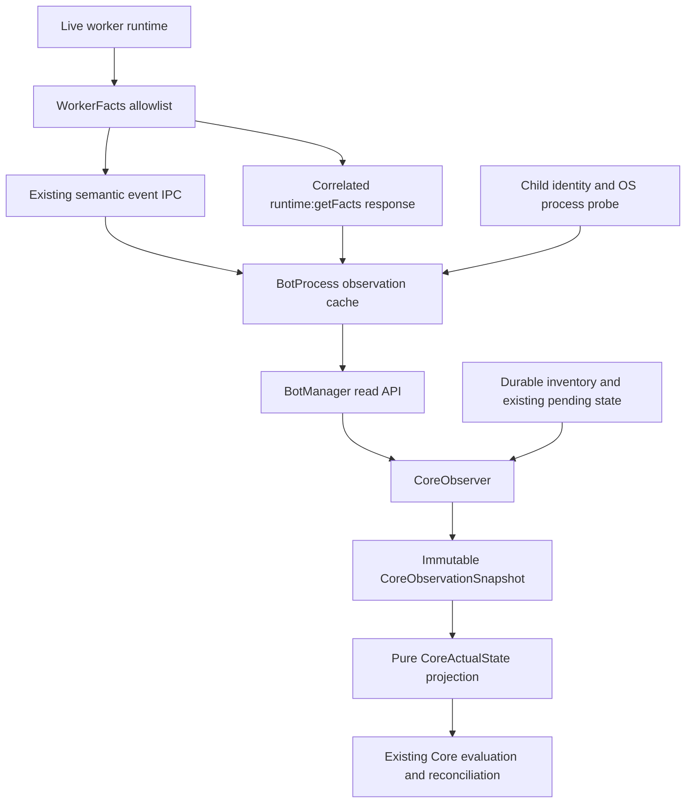

# Core v2 Phase 2 — authoritative observation

> **Phase 5 update — 2026-09-26:** [Lifecycle arbitration and graceful stopping](core-v2-phase5.md) now uses the shared action ledger, durable recovery state (schema v11), correlated quiescence, and truthful lifecycle settings/diagnostics. Historical lifecycle limitations below describe their original delivery. Autonomous Reseller trading remains disabled.

> **Phase 3 update — 2026-09-25:** [Durable actions and shared accounting](core-v2-phase3.md) are now implemented in schema v10. Phase 2's worker observation/readiness contract remains in force. Statements below about v9 and missing action coordination describe the Phase 2 delivery baseline.

Implemented 2026-09-25. This report supersedes the observation findings in the historical audit. Phase 1 canonical policy remains in force. Phase 2 changes the facts supplied to the existing controller; Phases 3–7 remain future work.

## A. Files changed

New production modules: `src/core/coreObserver.js`, `src/minecraftBot/worker/workerFacts.js`.

Runtime and transport: `src/botManager/botProcess.js`, `src/botManager/botManagerMain.js`, `src/minecraftBot/worker/botWorker.js`, `src/minecraftBot/worker/workerPublicEventBridge.js`, `src/minecraftBot/runtime/realmReadyGate.js`, `src/events/eventFactory.js`, `src/snapshots/botSnapshotStore.js`.

Core and UI: `src/core/coreActualState.js`, `src/core/autonomousCore.js`, `src/core/market/analysisCoordinator.js`, `src/webTerminal/public/js/coreController.js`.

Verification: new `tests/coreObservation.test.js` and `tests/helpers/fixtureObservation.js`; adapted fixtures in `tests/coreFoundation.test.js`, `tests/marketIntelligence.test.js`, `tests/runtimeIncidents.test.js`, `tests/runtimeReliability.test.js`; extended `tests/browserSmoke.mjs`. Existing executor fixtures now explicitly implement the observation interface; production has no fallback from cached status to healthy capacity.

Documentation: this report and addenda in `core-v2-phase1.md`, `architecture-audit.md`, `architecture-settings-inventory.md`, `core-v2-proposal.md`, `core-v2-migration-plan.md`. No database schema/migration file changed for Phase 2.

## B. Observation architecture

`CoreObserver.refresh()` performs bounded collection through the lifecycle owner. `snapshot()` builds and recursively freezes a detached structured clone. `CoreActualState.read(snapshot)` performs deterministic derivation with no DB reads, runtime reads or commands. `AutonomousCore.readActual()` is the common entry point for current Core facts, including AnalysisCoordinator and synchronous UI queries.

Inventory reads remain batched and cached by the existing database change revision. Snapshot construction reads current controls, pending replacements, account eligibility/cooldown, existing in-memory account reservations and generation state. No worker query or account generation is initiated by a UI snapshot read. Coherence means one immutable collected evaluation view with explicit per-source timestamps, not a simultaneous distributed measurement. Changes arriving during an awaited scan are covered by existing revision/generation checks and queued evaluation.

## C. Worker fact schema

The version 1 allowlist contains:

| Group | Fields |
|---|---|
| Identity | version, botId, accountId, incarnationId, sequence |
| Time | observedAt, workerStartedAt, lastSemanticChangeAt, lastProgressAt |
| Process-facing status | runtimeStatus, stopping |
| Connection | connected, protocolState, spawned |
| Position | status, targetRealm, confirmedRealm, realmReady, enteredAt |
| Role | configuredRole, activeRole, state, ready |
| Loaded task | taskId, type, itemId, enabled, buyPrice, sellPrice |
| Other prerequisites | serverId, blocked, health.alive |

The worker reads current local runtime objects synchronously. The result is sanitized again in the parent. Strings are bounded to 96 characters; nested objects are rebuilt from explicit fields. No password, Telegram credential, session, API key, raw config, Mineflayer object, inventory or chat payload is included. Facts are observations of what the live runtime knows; no new Minecraft command is used to verify them.

## D. Incarnation model

BotProcess generates a new UUID before every fork lifecycle and passes it in initialization. The worker retains this identity for its lifetime. Bot/account IDs and PID are insufficient: a restart can reuse all three. Parent message handling first checks child-object identity; semantic IPC also requires the current incarnation. Public event source and envelope include incarnation. Fact replies additionally require the active request ID, matching bot/account and increasing fact sequence.

Each new lifecycle clears previous readiness and observation cache and cancels old requests. BotManager, BotSnapshotStore and Core reject queued semantic EventBus updates from older incarnations. Analysis session task JSON now records incarnation alongside its existing PID; late results and cancellation cannot target a replacement incarnation. This uses existing JSON storage, not a new ledger or schema.

## E. Source precedence

Process evidence dominates semantic caches. No current child, an exited child or an OS probe reporting absence means `PROCESS_MISSING`, even if cached worker facts say ready. An inconclusive process probe is uncertainty. The read API does not redefine the supervisor's historical `isRunning()` handle check.

Within the current incarnation, newer sequence wins across query and semantic event facts. A successful query supersedes older cached events; a newer event can supersede a query. Old or mismatched facts cannot refresh the cache. A failed query explicitly removes readiness authority while retaining the last successful facts for diagnostics. Facts older than the freshness threshold cannot count as healthy capacity. Heartbeats alone never refresh semantic readiness.

Durable account ban, disablement, assignment and pool eligibility dominate worker belief. Manual holds come from Core control rows. Pending replacement/initialization comes from existing replacement rows; reservations come from the existing AccountPool set; generation pending comes from Core runtime. Account rows carry database provenance for their durable fields; the added reservation flag is an in-memory AccountPool observation, not a persisted claim. These facts do not prove remote login or role readiness.

## F. Exact readiness definitions

| Fact | Definition |
|---|---|
| processAlive | Current child exists, has no exit/signal code, has a PID and a read-only OS process probe confirms existence. ESRCH means absent; permission denied means existence; inconclusive errors mean unknown. |
| minecraftConnected | Process confirmed alive, fresh current-incarnation facts, worker protocol in `play`, protocol not ended, socket not destroyed and client not ended. |
| spawned | Connected plus live entity and the worker's existing post-spawn `running` lifecycle state. |
| targetRealmConfirmed | Spawned, position `realm`, current confirmed and target realm both equal the configured realm, and loaded server equals the configured server. |
| realmReady | Target confirmed plus the existing RealmReadyGate prerequisites and elapsed gate delay. The pure `inspect()` uses the same default 15-second delay plus existing 0–3-second jitter as base runtime readiness. |
| roleReady | Realm ready, active role matches loaded task, worker/task runner not stopping, and role-specific initialization is ready. |
| workReady | Role ready, health alive, no operational/AFK block, assigned durable account eligible, loaded account matches assignment, loaded task enabled. |

Analyst initialization means an active Analyst task whose `stopped` flag is false. Its current job distinguishes busy from idle. Analysis jobs retain their existing configurable additional readiness timing; observation does not change that execution gate. Reseller initialization requires active task `running`, not paused, and not in `starting`, `waiting_for_realm`, `waiting_realm_unlock` or `stopped`.

`lastProgressAt` records changes to connection, spawn, position, realm confirmation/gate, active role/readiness, blocking and stopping. It is not refreshed by heartbeats or identical queries. It records meaningful stage changes including regressions, not a monotonic success ladder. `readinessAgeMs` is elapsed time since this change (or process start if unavailable). `lastSemanticChangeAt` separately covers other changed task/role facts.

## G. Actual capacity

Analyst actual capacity is the count of work-ready workers with loaded Analyst task. Reseller actual capacity is the count of physically work-ready workers with loaded Reseller task; it can describe an existing manually launched runtime. This does **not** grant autonomous trading capability: production `effectiveOperationsPolicy.roles.reseller.executable` remains false and `TRADING_EXECUTION_DISABLED` remains visible. No connected-only worker is executable capacity.

Separate backend counts expose confirmed processes, connected workers, realm-ready workers, work-ready workers and uncertain workers. Uncertain or live-but-unready workers contribute zero ready capacity. The legacy projected `running` alias conservatively includes confirmed-live or uncertain workers for existing occupancy guards, preventing a temporary query timeout from being treated as a safe stopped slot. Occupied/start-intent counts are not ready capacity.

## H. Event-triggered observation

Existing semantic events carry compact facts: `bot.status.changed`, `bot.position.changed`, `bot.disconnected`, `bot.kicked`, `bot.runtime.ready`, `bot.realm.readiness`, `bot.analysis.status`, `task.state.changed`, `bot.runtime.incident`. Current facts update the cache before event publication; existing Core debounce/coalescing remains. Events such as position/readiness now wake evaluation as well. Chat and ordinary heartbeat traffic do not send full fact payloads.

Ordinary evaluations reuse facts received within 15 seconds and query missing/stale facts as necessary, with a one-second retry floor after an attempted query. Repeated callers share one pending request per worker and one observer refresh. A later Core trigger remains queued under the existing single-flight controller.

## I. Periodic authoritative observation

The existing timer still checks every 10 seconds against the configured safety threshold, default 60 seconds. The threshold now measures time since the last authoritative scan, independently of the most recent event evaluation; continuous events cannot postpone verification forever. A due safety pass actively queries live workers, regardless of cache freshness, before existing planning/reconciliation. There is no second timer or controller.

## J. Startup

`CORE_STARTED` forces a bounded scan after service initialization. Already-live workers answer current facts without emitting a new ready event. Absent workers are immediately observable without worker cooperation. Unqueryable workers are explicitly unavailable. Core disabled/keepStopped retains observation while existing policy prevents unauthorized actions.

## K. Timeout and failure behavior

Defaults: 1-second request timeout, concurrency 32, 3-second scan deadline. Internal constructor overrides are validated (request ≤5 seconds, concurrency ≤64, scan ≤10 seconds, freshness ≤60 seconds); these are not new persisted policy fields.

Reply correlation, timeout, IPC error/disconnect, process exit, new lifecycle, abort, Core stop and application lifecycle stop resolve/clean up pending requests. Send callback errors also fail promptly. One unavailable worker does not prevent independent workers from replying. The overall deadline cancels outstanding requests and exposes unqueried count. Subsequent scans rotate through the inventory so a deadline does not starve later workers. A shared request shares its first caller's cancellation context; Core stop additionally cancels all lifecycle-owner observation requests.

Qualities are `FRESH`, `STALE`, `UNAVAILABLE`, `PROCESS_MISSING`, `INCARNATION_MISMATCH`. Unavailable cached data remains diagnostic, never healthy capacity. Existing supervisor recovery is unchanged; the observer does not kill/restart a slow worker.

## L. Lost-event repairs

Tests change the live worker fixture independently of parent event delivery, using actual WorkerFacts, BotProcess transport handlers, BotManager and CoreObserver. Active observation repairs lost realm/role-ready events. Process probing invalidates cached readiness after silent disappearance without an exit event. Startup discovers stopped workers without any event. A replacement still in hub cannot inherit an old incarnation's readiness, even with PID reuse and queued old EventBus messages. A heartbeating worker in hub/AFK or uninitialized role shows zero operational capacity and an explicit blocker.

## M. Deliberate remaining limits and final source audit

The audit searched `bot.status`, `runtimeStatus`, `positionStatus`, `workReady`, `isRunning`, `analysisState`, `getBotRuntimeState`, `getBot` and snapshot access in DecisionEngine, Reconciler, AutonomousCore, AccountReplacements and AnalysisCoordinator.

| Remaining access | Classification |
|---|---|
| DecisionEngine capacity and Reconciler planning | Consume projected actual state only. `running`/desired-state occupancy is conservative transition accounting, not healthy capacity. |
| Reconciler apply: `getBot().analysisState` for existing Analyst stop | Conservative final execution guard retained; stale idle status can defer a stop. It does not decide actual capacity. New safe-stop/recovery ownership is outside Phase 2. |
| Reconciler and AccountReplacements apply: `isRunning`, desiredState, startingConfiguration, restartRequested | Existing final execution guards against changing a live/starting worker. No capacity authority. |
| AccountReplacements completion | Uses projected `workReady` and role/account match. Existing durable replacement rows remain. |
| AutonomousCore `getBot().sendEvent('runtime:configure')` | Existing configuration dispatch, not observation authority. Snapshot reserve counts now also use the common observation projection. |
| AnalysisCoordinator `getBot` | Command dispatch, same-incarnation cancellation and legacy display `analysisState` assignment. Planning and result validation use `readActual()`; failed terminal events retain their real failure reason even if runtime is no longer ready. |
| BotSnapshotStore / QueryService / BotManager legacy status | Compatibility/display and lifecycle execution. Not Core capacity input; additive observation diagnostics are available. |

No unexplained direct event-cache authority remains in Core planning. Recovery arbitration, durable reservations/action ledger, safe Reseller scale-down and Trading Intelligence remain unimplemented. Observing a silent disappearance proves the deficit; it does not guarantee restart if the unchanged supervisor still retains a stale handle or intent. Existing controller action awaits can still delay the next cycle: only observation waits were bounded here. Partial/deadline scans can require later passes. OS existence probes cannot independently establish process birth identity; child-object plus incarnation validation protects semantic facts, and an unrelated reused PID cannot supply valid worker facts. No live Minecraft acceptance run was performed.

## N. Performance and diagnostics

One structured `CORE_OBSERVATION_COMPLETED` log per forced scan reports workers, queried, refreshed, timeouts, unavailable, stale, duration, reason, deadline and unqueried. Snapshot metrics also summarize current stale/unavailable observations. No per-worker success logging was added. `lastAuthoritativeAt` denotes completion of an authoritative scan attempt, including partial/unavailable results; metrics must be inspected alongside it.

Final controlled measurement: 20 workers, concurrency 8, request timeout 40 ms, one nonresponsive worker: **47 ms**, 20 queried, 19 refreshed, 1 timeout, 1 unavailable. A separate 20-worker all-hung test with concurrency 4 and a 25 ms scan deadline finished each of two passes in **31 ms**, cancelled all four pending requests each pass, reported 16 unqueried, and queried a different group on the next pass. These measure in-process simulated IPC, not deployed Mineflayer latency. Repeated fresh reads do not create worker IPC. A deadline bounds asynchronous collection; synchronous inventory projection and OS probes still add CPU time.

## O. UI

The existing Core page now separates desired and work-ready role counts, process/work-ready totals and uncertain observations. A collapsible Ukrainian diagnostics table exposes process, connection, position, realm/role/work readiness, quality, query/event/progress timestamps, source, incarnation and blocker. Identifiers remain in diagnostics. The frontend displays backend counts and never recalculates capacity. Current snapshot counts replace older evaluation counts; current observed drift cannot retain a `stable` overview label. Reconciliation diagnostics retain their evaluation timestamp and describe that completed evaluation.

## P. Verification

Final `npm test`: **267 passed, 0 failed, 0 cancelled, 0 skipped**, 16,250.9859 ms. This retains the **244-test Phase 1 baseline** and adds **23 observation tests**. Final `npm run test:ui`: **PASS**, including diagnostic rows, Ukrainian quality labels, backend counts, existing policy behavior, responsive layout and no JavaScript exceptions.

Tests use temporary SQLite databases, fake transport and a local browser API; no live credentials/database/game connection were used. New observation cases cover incarnation rejection, readiness prerequisites, silent absence, lost readiness, stale facts, bounded failure, cancellation, immutable account authority, production capability gating, concurrent collection, send callback failure and scan fairness. The browser run requires permission to launch the installed Chrome binary; it uses an isolated temporary profile and mock API.

## Q. Database status

Schema remains **v9**. No v10 migration and no durable table for worker observations/incarnations. Existing analysis task JSON carries incarnation for session validation. Rapidly changing facts and lifecycle identities remain in memory. Shared Phase 1 generation allowance and existing replacement/generation storage remain unchanged.

## R. Phase 3 readiness

Phase 3 can consume immutable facts, explicit freshness/uncertainty, incarnation identity, readiness/progress and existing pending provenance. It must still introduce the authorized durable action/reservation contract; this phase intentionally does not pre-create it. Phase 3 was not started.
