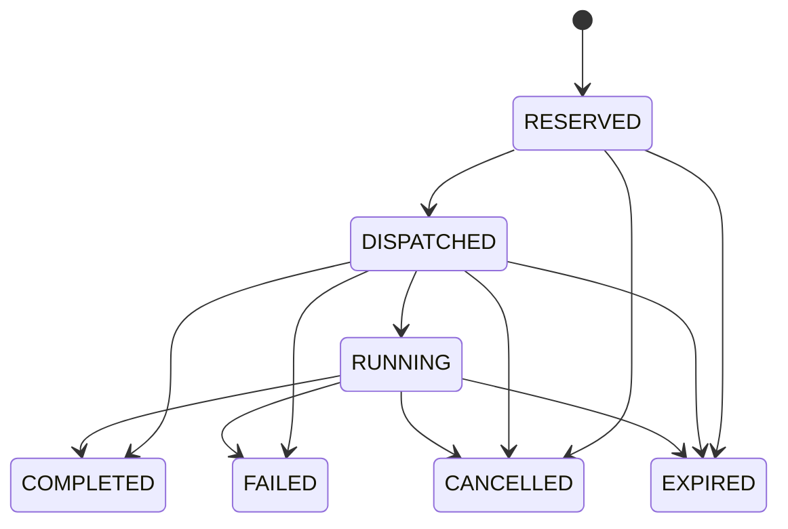

# Core v2 Phase 3 — durable actions and shared accounting

> **Phase 5 update — 2026-09-26:** [Lifecycle arbitration and graceful stopping](core-v2-phase5.md) now uses the shared action ledger, durable recovery state (schema v11), correlated quiescence, and truthful lifecycle settings/diagnostics. Historical lifecycle limitations below describe their original delivery. Autonomous Reseller trading remains disabled.

Implemented 2026-09-25. Phase 1 canonical policy and Phase 2 authoritative worker observation remain the foundations. This phase adds durable execution accounting to the existing Core pipeline. It does not implement the Phase 4 controller rewrite or transfer supervisor ownership.

## 1. Files changed

New modules: `src/core/actionLedger.js`, `actionCoordinator.js`, `transitionAccounting.js`; new acceptance suite `tests/coreActions.test.js`.

Integration: `src/core/autonomousCore.js`, `coreReconciler.js`, `coreStore.js`, `coreObserver.js`, `coreActualState.js`, `accountReplacements.js`, `canonicalPolicy.js`, `commandService.js`; `src/data/databaseSchema.js`, `databaseMigration.js`, `dataBaseManagerMain.js`; `src/accounts/accountPool.js`; `src/webTerminal/public/js/coreController.js`.

Verification/UI fixtures: `tests/browserSmoke.mjs`; schema assertions and backup names in `tests/corePolicyAuthority.test.js`, `marketIntelligence.test.js`, `runtimeIncidents.test.js`, `storageMigration.test.js`, `telegram.test.js`. Historical tests keep their behavior assertions; expected current schema/backup version changes to 10.

Documentation: this report plus Phase 2, audit, settings inventory, proposal and migration-plan addenda. No runtime role, Mineflayer, Telegram, Anti-AFK or Market execution implementation was replaced.

## 2. Database version and migration

Schema is now **v10**, verified from the v9 repository baseline. The migration adds three tables and indexes. Existing migration machinery makes a complete `backups/<timestamp>-v10/afina-before-v10.db` backup, then uses a transaction, foreign-key validation and integrity checking. Version 9 canonicalization is no longer rerun when upgrading an already-v9 DB. Fresh installation applies both upgrades in order.

No old fields, policies, credentials, task assignments, replacement rows, journal records or compatibility archives are dropped. Reopening v10 is a no-op. Ledger tables are read-only in the database editor. Migration itself does not dispatch commands; startup accounting recovery is a separate runtime step. All validation uses temporary DBs, never the live user database.

Rollback requires stopping the application, resolving in-progress operations, then restoring the complete pre-v10 backup with matching old code. Editing `user_version` is not a rollback. The old binary cannot safely interpret new nonterminal action ownership; do not run both versions against one DB.

## 3. Ledger schema and observation contract

`coreActions` contains actionId, deterministic idempotencyKey, logicalKey, type, state, botId, accountId, role, quantity, created count, policyRevision, desiredRevision, inputRevision, decisionId, createdAt, updatedAt, deadlineAt, attempt, reason, resourceKeys JSON and allowlisted metadata JSON.

Metadata includes operation name, generation participation, item/expected task fields, replacementRequestId, imported flag and accepted incarnation when available. It does not include raw plans, runtime objects, passwords, account credentials or session data. `updatedAt` records the latest transition; separate timestamps for every intermediate state were unnecessary for this implementation.

`coreActionResources(resourceKey PRIMARY KEY, actionId REFERENCES coreActions ON DELETE CASCADE)` holds active ownership. `coreGenerationResults(requestId PRIMARY KEY, quantity, accountIds JSON, createdAt)` is a durable generation receipt. Receipts contain IDs only, not credentials. They remain after terminal action history pruning as idempotency tombstones, so deleting an account or pruning history cannot cause an old request to regenerate credentials.

Observer adds active actions, resources and generation receipts to its immutable snapshot. Generation pending is projected from the ledger/receipts with `source=action_ledger`. Observer remains read-only. DesiredState still describes what should exist; it never subtracts pending work from its targets.

## 4. State machine



RESERVED is durable ownership before invoking an executor. DISPATCHED means the executor has been invoked and acceptance/result may still be unknown. RUNNING means the existing executor returned acceptance but observation must still prove completion. Terminal records cannot be reopened or overwritten by late callbacks. Terminal transition releases resource rows atomically. A retry creates a new attempt after existing backoff/eligibility guards.

One-time semantic `core.action.created/dispatched/running/completed/failed/cancelled/expired` events use the existing EventBus/WebSocket path. State is durable before publication. Lost events are repaired by observation and the next snapshot. No per-tick action event is emitted.

## 5. Supported types and execution boundaries

| Type | Existing operation | Covered demand | Completion |
|---|---|---|---|
| START | Analyst assignment/start; existing foundation assignment/start contract | One intended role slot, never ready capacity | Fresh authoritative expected role/account/task readiness; accepted incarnation when recorded |
| STOP | Existing idle-Analyst stop only | A pending stop, not a new positive capacity slot | Observed process absence |
| ASSIGN | Existing stopped-task release/update | Resource ownership only | Existing local update/sync succeeds |
| GENERATE | Existing `accounts.generate` → transactional generator | Account supply quantity only | Account IDs committed with receipt, or normal executor result |
| REPLACE | Existing AccountReplacements stages | One logical workload transition; account generation participation separately | Existing replacement evidence plus authoritative expected account/role/task readiness |

There is no autonomous Core restart executor to migrate. Supervisor restart/reconnect remains external. Analyst analysis sessions are workload execution, not operational capacity actions. GUI refreshes, movement, chat/binding, inventory steps and Reseller transaction steps do not enter the ledger.

## 6. Resource reservations

START/STOP/ASSIGN/REPLACE reserve `bot:<id>`. A known selected account reserves `account:<id>`. Reservation and active logical uniqueness are enforced transactionally, independently of the controller's in-memory single-flight. One account cannot be claimed by two actions; START and STOP cannot simultaneously own a bot. Independent bots/accounts can proceed independently. No invented role-slot identities are used.

The existing assignment service still serializes account mutations. Its DB boundary now honors ledger claims and, for an internal action, selects its claimed account. Existing AccountPool reservations remain a low-level guard; AccountPool acquisition and replacement candidate selection also exclude other actions' claims. Manual commands do not need an action record. A manual operation can select another eligible account; a conflicting manual bot operation first invokes existing manual ownership handling, which cancels that bot's autonomous action and releases its claim.

Replacement generation claims the newly created account inside the generator's existing transaction along with the replacement update and generation receipt. Nested transactions are deliberately avoided at this boundary. Rollback removes accounts, pool rows, callback changes, claims and receipt together.

## 7. Idempotency and atomicity

`logicalKey=bot:<id>` identifies unresolved lifecycle work; ordinary generation uses one `generation:reserve` batch at a time. An active logical key returns the existing action. A SHA-256 idempotency key covers logical key, policy revision, desired revision and persisted attempt. UUID identifies the record, not logical demand. Active uniqueness, resource primary keys and idempotency uniqueness are database constraints.

Ordinary generation is intentionally a single bounded quantity batch (existing generator maximum 100). A pending batch is recognized; remaining uncovered demand is reconsidered after it settles. Independent worker/replacement actions remain possible. Policy and shared total/pending budgets are rechecked at execution, excluding the executing action's own uncreated quantity. Before reserving generation, demand is recomputed from current facts so earlier actions in the same cycle cannot leave a stale generation plan valid.

Generation receipt insertion occurs in the same transaction as account creation. Repeating the same request returns its recorded IDs without calling the credentials factory. A different quantity for that request is rejected. The existing generator is all-or-nothing: partial transaction failure yields zero accounts and no receipt. The ledger retains quantity and created count; unfulfilled quantity is their difference. Injected executor results may report a smaller created count, but are not used to replay an ambiguous request after restart.

## 8. Shared accounting algorithm

The pure `transitionAccounting(actual, desired, operations)` is the common production calculation.

For each role:

```
ready = authoritative Phase 2 work-ready count
actionCovered = unexpired active START/REPLACE actions whose bot is not already ready
external = unclaimed, non-ready, non-banned, non-manual, unblocked observed transitions
inProgress = actionCovered + external
uncovered = max(0, desired - ready - inProgress)
overshoot = max(0, ready + inProgress - desired)
```

STOP has its own count and does not add capacity. Occupied process slots remain separate from ready count. A ready bot is never counted again as pending. External coverage requires observed start/restart/desired-running intent and progress age below the existing action timeout. Older uncertainty remains visible and blocks reusing that bot but no longer claims indefinite healthy progress.

For account supply:

```
workerDeficit = sum(role.uncovered)
boundCoverage = min(workerDeficit, eligible stopped configured unclaimed bound accounts)
replacementOwned = uncovered banned/replacement workloads owned by replacement mechanics
replacementNeed = active replacement generation requests without a committed receipt/account
accountDemand = max(0, workerDeficit - boundCoverage - replacementOwned) + replacementNeed
pendingCreation = sum(uncreated GENERATE + replacement-generation quantities)
uncoveredAccounts = max(0, accountDemand + reserveTarget - eligibleFreeAccounts - pendingCreation)
```

`replacementOwned` is a workload-routing decision, not positive healthy capacity. It preserves the existing replacement backoff: ordinary generation cannot bypass a failed replacement's owner by creating the same account demand elsewhere. A replacement generation request covers its own account need; it cannot also count as a free spare account. Existing bound accounts and free eligible accounts come before new generation. Zero reserve target still permits creation for uncovered ordinary work. Zero total-account maximum still forbids autonomous creation. Canonical pending/total limits, permission and execution-time budget checks remain in force.

## 9. START lifecycle

The current planner finds a permissible stopped candidate using shared uncovered demand. Coordinator reserves bot/account and policy/desired/input revisions, then invokes existing assignment/configuration/start code. Existing per-await guards remain. No new Mineflayer lifecycle code is introduced. The action waits in DISPATCHED/RUNNING while observation supplies current readiness. Successful START completion verifies role, expected loaded task fields, selected account and accepted incarnation if known. Before acceptance is recorded after a crash, current matching readiness itself proves the requested state exists and avoids replay.

Legacy `coreBotControl.pending*` fields remain compatibility mirrors and a startup import source. Production projected pending ownership comes from active actions. The old independent `AutonomousCore.settlePending` completion path was removed. Action terminal settlement updates the linked decision and clears matching compatibility pending state. Existing assignment timestamps/manual holds/failure guards are retained.

## 10. GENERATE lifecycle

Reserve quantity → invoke existing command with internal action ID and guard → transactional account creation plus correlated receipt → complete. Generation does not imply registration, worker spawn or remote readiness. Failure preserves existing generation retry timing; retryAt is reconstructed from durable real generation failure/expiry on restart. Permission/budget rejection does not create generator-failure backoff. Manual account generation retains its existing uncorrelated user-command contract.

## 11. REPLACE lifecycle

The ledger links the existing replacement row by bot and request ID. The replacement subsystem retains requested/generating/created/selected/initializing/completed/failed/deficit mechanics, notifications, task preservation and retryAt. It prefers a ready candidate, otherwise checks shared generation allowance and invokes the same generator. Its generated account receipt uses actionId. After rotation/start acceptance, the action remains active until observation proves readiness. Failed/deficit/cancelled replacement state reconciles the action terminally; another attempt must respect the existing replacement backoff.

No replacement rewrite occurred. Its `plan()` still settles existing replacement mechanics; this side effect remains an explicit Phase 4 cleanup candidate. Shared accounting and action resource filtering prevent those mechanics from requesting a second active lifecycle operation.

## 12. STOP lifecycle

Only the existing idle-Analyst stop path is migrated. It reserves the bot, retains manual/policy/idle checks, dispatches the existing stop command, and completes on process absence. An unavailable fact query is not proof of exit. A policy reduction after START acceptance does not cancel into an immediate STOP; the active resource blocks contradictory lifecycle work until settlement. General Reseller safe stop remains unsupported.

## 13–14. Supervisor transitions and startup recovery

Supervisor timers/reconnect attempts, starting configuration and restart intent stay owned by BotManager. Observation/accounting recognizes them conservatively without creating Core recovery actions. Existing final executor guards continue to reject changing an alive/starting/restarting bot. Full arbitration across a stale external transition and another bot's launch is still Phase 5; the ledger does not claim to own supervisor capacity decisions.

Startup performs Phase 2 bounded observation, imports legacy pending START/replacement progress once when no action owns that bot, then reconciles active actions before new planning. Imports link existing resources/decision/replacement rows and original timeout origin; they never replay historical decisions or blindly redispatch accepted work. Already-ready START/REPLACE and missing-process STOP settle from observation. Old RESERVED actions are cancelled as undispatched. Ambiguous DISPATCHED generation without receipt remains reserved until expiry rather than issuing duplicate creation. Existing replacement stage/receipt can prove committed creation independently of a missing event.

## 15. Crash consistency

| Crash boundary | Recovery |
|---|---|
| RESERVED before dispatch | Cancel on startup; current desired demand can later reserve a fresh attempt |
| DISPATCHED, receipt/acceptance unknown | Observe; do not blindly redispatch; retain claim until evidence/expiry |
| Worker ready before action completion update | Complete from current matching facts |
| Accounts committed before completion update | Read transactional receipt; complete with exact created IDs/count; never regenerate |
| Replacement created/selected/initializing | Reconnect to durable row, claim and observation; preserve its retry/initialization mechanics |
| Terminal state persisted | Terminal is immutable; no replay or late callback reversal |

Uncertain generation eventually expires. Production generation has a synchronous transactional boundary: if creation committed, its receipt also committed; otherwise a later guarded invocation cannot execute an expired request. An arbitrary third-party executor that ignores the provided guard is outside this guarantee.

## 16–17. Revision, cancellation, dispatch and deadlines

Records distinguish policyRevision, desiredRevision, inputRevision, observation timestamp, actionId and incarnation. RESERVED work cannot dispatch under a changed policy. Existing generation/input/manual guards remain checked at executor boundaries. Accepted/running work is exposed as progress or overshoot after target reduction; Phase 3 adds no unsafe inverse action. Manual bot ownership cancels its autonomous action; queued guarded execution then fails safely. Core stop invalidates guards, clears dispatcher timers and stops waiting; durable uncertain actions remain available for next startup observation.

Dispatch invokes existing execution asynchronously and yields after local acceptance or **10 ms per action**, whichever comes first. A broken asynchronous executor cannot hold Core's cycle to full completion. Its action remains DISPATCHED until result/observation/deadline. The existing `actionTimeoutMs` supplies the deadline (default **60 seconds**, supported range 1–600 seconds), with existing `failureRetryMs` default **60 seconds**. Unknown operations are not assigned a new shorter production timeout. Outstanding execution timers mark expiry and release references; finished acceptance relies on normal observation/safety reconciliation for remaining lifecycle timeout. The existing 60-second safety scan/10-second check remains unchanged.

JavaScript cannot preempt a synchronously blocked executor or DB call; bounded dispatch addresses asynchronous waits. Timers fire when the event loop can run. The existing serial controller still pays per-action dispatch yield and synchronous planning cost; whole-cycle budgets and scheduling are Phase 4. There is no second evaluation loop.

## 18–20. Final pending-authority audit

The final search covered pending, starting, stopping, restart, replacement, generation, reservation, desiredState, startingConfiguration, restartRequested, inFlight, promise, action and transition across Core, lifecycle, accounts, generation and command paths.

| Mechanism | Classification after Phase 3 |
|---|---|
| coreActions / coreActionResources | **A: authoritative Core action state and ownership** |
| coreGenerationResults | **B: correlated durable executor result**, used for action recovery |
| coreBotControl pending IDs/after/since | **C: compatibility mirror/import source**, no independent Core completion authority |
| coreBotControl manualHold/assignment times/failedUntil | Existing user intent and executor backoff guards, not competing pending work |
| accountGeneration.pending/state | **B/C: executor-local compatibility diagnostics**; production budget/snapshot pending uses ledger quantities |
| accountGeneration.retryAt | Existing retry policy; restored from action failure evidence |
| accountReplacements rows/stages/retryAt | **B: durable replacement execution mechanics**, linked to action ownership; replacement workload routing preserved |
| AccountPool.reserved / assignment queue | **B: low-level safety/serialization**, checks ledger claims; not independent Core demand accounting |
| Reconciler temporary used/kept/reserved collections | Per-plan selection only; ledger claims protect dispatch and pending task slots |
| Reconciler raw fixture accounting fallbacks | Existing standalone unit-executor contract only; production always supplies shared accounting/coordinator |
| BotManager desired/reconnect/start/restart flags and timers | **D: observed external transitions**, recovery ownership deliberately unchanged |
| Analyst session reservations | Workload execution ownership; not worker capacity or account generation |
| Observer inFlight / Core trigger queue / dispatcher jobs | Request coalescing/execution handles; durable ledger is authoritative for operational work |

No unexplained independent Core pending authority remains. Decision journal explains why; mutable action ledger explains what is executing. Active linked decision records are protected from journal pruning. Active action queries exclude terminal history. Recent terminal history defaults to 50; pruning retains at least the configured journalLimit window and seven days of terminal evidence. Generation receipts are retained for idempotency. No new recovery planner, managed restart policy, safe trading stop or Trading Intelligence was added.

## 21. UI and assessment

The Core page adds a collapsible Ukrainian action/transition view: type, bot/account, role, state, creation/deadline, attempt, policy revision, requested/created count and reason. Per-role desired, work-ready, in-progress, uncovered and overshoot are backend values; the frontend does no capacity math. Failed/terminal history is visible. Existing realtime Core refresh handles semantic action events.

Active work is not STABLE. Covered drift with valid actions and no blockers uses the existing `reconciling` status; uncovered/blocked drift remains degraded. Current observation counts, configured/effective targets and capability blockers remain separate.

## 22–23. Verification and integrity

Baseline `npm test`: **267 passed, 0 failed**, 16,460.8098 ms. Complete verification `npm test`: **290 passed, 0 failed, 0 cancelled, 0 skipped**, 19,108.0843 ms. The **23 new action tests** cover duplicate/conflicting reservations, role/account distinction, no-event completion, incarnation mismatch, expiry, policy edits, bounded hung dispatch, manual cancellation, generation receipts/rollback/restart boundaries, legacy imports, production pending quantity/backoff, migration backup/integrity and trading capability.

After the final account-reserve diagnostic correction, `node --test --test-isolation=none tests/coreActions.test.js tests/coreFoundation.test.js tests/runtimeIncidents.test.js`: **98 passed, 0 failed**. `npm run test:ui`: **PASS**, including Ukrainian active/failed action rows, exact backend desired/ready/in-progress/uncovered values, existing policy/observation controls, responsive layout and no JavaScript exceptions. Chrome launch used the existing approved local smoke-test workflow.

Temporary v9→v10 migration proves unchanged policy/account data, empty initial actions, schema10, `integrity_check=ok`, no foreign-key errors, complete v9 backup and idempotent reopen. Existing older-version migration fixtures remain in the full suite. No live database or Minecraft connection was used. Browser smoke runs the real frontend against its local mock API and isolated Chrome profile.

## 24–25. Trading status and Phase 4 readiness

Production autonomous Reseller trading remains **TRADING_EXECUTION_DISABLED**. Ledger infrastructure does not enable it. Existing manually running/replacement runtime observations retain their established semantics.

Phase 4 can consume durable actions, resource claims, generation receipts, authoritative observation and shared uncovered-demand calculations. It still owns whole-cycle scheduling/bounds, broader controller purity and scheduling cleanup. Supervisor ownership and general safe stopping remain Phase 5. Phase 4 was not started.
