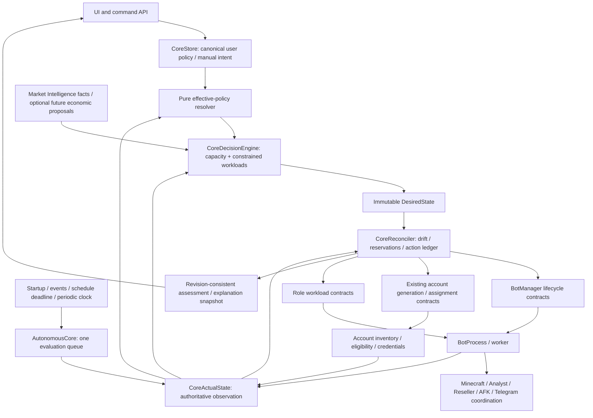

# Core v2 proposal — review before implementation

> **Phase 5 update — 2026-09-26:** [Lifecycle arbitration and graceful stopping](core-v2-phase5.md) now uses the shared action ledger, durable recovery state (schema v11), correlated quiescence, and truthful lifecycle settings/diagnostics. Historical lifecycle limitations below describe their original delivery. Autonomous Reseller trading remains disabled.

> **Phase 3 update — 2026-09-25:** [Durable action/reservation accounting is implemented](core-v2-phase3.md), including generation correlation, startup action recovery, observation-based settlement and bounded asynchronous dispatch. The future controller/recovery architecture below is still a target. Phases 4–7 remain unimplemented; production autonomous trading remains blocked.

> **Phase 2 update — 2026-09-25:** [Authoritative observation is implemented](core-v2-phase2.md): current worker queries, incarnation guards, immutable observation/projection, explicit readiness and uncertainty, startup and periodic lost-event repair. Schema remains v9. Durable action coordination, controller replacement, recovery ownership, safe stops and Trading Intelligence remain future work. Earlier status paragraphs below are historical delivery records.

> **Current status — 2026-09-25:** [Phase 1 is implemented](core-v2-phase1.md): canonical policy and truthful capability reporting only. The architecture below remains the future target; authoritative observation, durable transitions, unified controller, managed recovery, safe stops and Trading Intelligence have not been implemented by Phase 1. The original proposal text is retained for context.

This is a proposed target, not current behavior. The evidence is in [architecture audit](architecture-audit.md) and [settings inventory](architecture-settings-inventory.md). No implementation is included in this task.

## Definition and component boundaries

Core is a continuous reconciliation controller: it determines operational capacity and workload intent from current observations and effective policy, then requests bounded actions. Events accelerate observation; startup and periodic observation make correctness independent of event delivery. It owns decisions, not Minecraft mechanics.

Preserve existing modules where possible. Four control-plane responsibilities are enough: policy resolution, observation, pure desired/drift planning, and action coordination. They can remain functions in existing CoreStore/AutonomousCore/CoreActualState/CoreDecisionEngine/CoreReconciler modules. They do not require new services or a framework. An action ledger is durable state owned by the reconciler, not a separate scheduler daemon.



| Existing component / responsibility | Inputs → outputs | Owned state | Forbidden responsibilities |
|---|---|---|---|
| CoreStore / policy resolver | validated user edits + clock/manual constraints → configured/effective policy | one canonical revisioned intent document; explicit compatibility adapters | worker starts, network protocol, economic facts |
| AutonomousCore | trigger reasons → serialized evaluation and assessment | queue, current controller epoch, last successful observation/evaluation | SQL account generation, Mineflayer calls, independent policy decisions in event handlers |
| CoreActualState | inventory, BotManager facts, action ledger, workload/health facts → immutable snapshot | bounded revision caches with freshness | mutate eligibility, settle actions, assume event history equals current reality |
| CoreDecisionEngine | snapshot + effective policy + optional proposals → DesiredState | none | writes, time reads, random IDs, worker IO, hidden store queries |
| CoreReconciler | desired vs observed + transitions → intents, reservations, outcomes | action ledger, retry/deadline state | credentials, GUI actions, a second capacity policy |
| BotManager/BotProcess | authorized lifecycle action → actual process facts/outcome | process handles, incarnation IDs, heartbeat/progress, stop/kill mechanics | choose target counts, change policy, authorize retries independently for managed bots |
| Account subsystem (existing G/assignment/pool) | generate/bind/initialize request → durable facts | credentials, binding uniqueness, eligibility, ban history | decide number of roles, select profitable products, bypass autonomous global budget |
| Analyst / Reseller | assigned workload + role config → progress/result/readiness | execution task, safe-stop boundary, GUI ownership | change global desired capacity or policy |
| Market Intelligence | observations → scoped market facts/confidence/freshness | sessions, raw observations, models/history | autonomously start bots or manufacture profitability |
| UI / gateway | edits/manual commands → canonical intent; snapshots → display | unsaved drafts and presentation | derive authoritative DesiredState, infer stable from “no next action,” implement reconciliation |

Telegram remains a protocol/resource subsystem with its existing session store and cancellation checks. It supplies binding/initialization facts through account/runtime contracts; Core never receives passwords, sessions, raw authentication commands, or Telegram protocol implementation.

## Configuration domains and sole authorities

| Domain/fact | Sole authority | Migration rule |
|---|---|---|
| Operational user intent | canonical Operations policy in CoreStore | one automation switch, role targets, hard global ceiling, schedules, reserve, recovery and ownership policy |
| Economic intent | separate item/workload constraints and future strategy policy | current overrides preserved; unavailable economics cannot silently choose role count |
| Analyst/Reseller execution config | existing role settings, domain-specific validated descriptors | move analysis GUI timing out of operational policy; preserve values/behavior |
| Runtime tuning | anti-AFK / realm/protocol configuration | preserve existing worker code; no capacity semantics |
| Infrastructure config | DB/process/logging/EventBus/Telegram/captcha config | not a user capacity source |
| Effective constraints | pure resolver output for one revision and observed clock | never persisted as editable intent |
| Desired state | pure Core calculation | persisted only as derived explanation/cache, recompute at startup |
| Worker reality | BotManager current incarnation + refreshed worker facts | process handle alone is not proof of usable capacity |
| Account reality | accounts/pool/ban/binding records plus initialization facts | one eligibility predicate; distinguish selectable credentials from initialized account |
| Pending work | reconciler action ledger | no summing independent counters for the same resource |
| Market facts | MarketStore scoped by server/realm/item | retain unknown values as unknown |

Remove `capacity.target` as an editable source: total desired is the sum of resolved role targets. Retain one hard global maximum. Remove global minimum unless a concrete cross-role invariant is justified; per-role minimum has a clear assessment/repair-priority purpose. Role min is a lower health boundary, target the normal operating point, max a hard autonomous ceiling. Without an explicitly implemented economic scaling mode, desired equals the scheduled target constrained by maxima. Unsupported roles are rejected or shown as unavailable with a blocker, never silently accepted as executable.

Role `autoStart`/`autoReplace` and stop behavior must either have one documented consumer with tests or be removed from editable UI during migration. Do not add more feature flags to hide ownership problems. Retain existing needed policy values, consolidate duplicates, and represent execution capability separately from user intent.

## Explicit precedence

1. Safety facts and hard constraints: banned/disabled account, invalid placement, resource exclusivity, hard autonomous ceilings, unavailable execution capability. No override bypasses these.
2. Explicit manual ownership/pinning: managed bot is excluded from autonomous reassignment/replacement; safety can still stop it. Manual intent and any resource consumption remain visible.
3. Automation/startup mode: disabled means observe and retain existing manually owned work, not auto-start/repair; keepStopped blocks autonomous starts until an explicit resume intent. Maintenance blocks starts/generation/replacement and **allows safe managed stops**. It is not implemented by setting all execution permission false.
4. Schedule overlays on base role intent, then deterministic role-priority clipping to global autonomous maximum. Expose every clip, especially below role minimum.
5. Base role targets and reserve demand.
6. Workload/item constraints and optional economic recommendations inside the capacity envelope. Hard workload restrictions remain enforced before execution; they can create a blocker, not authorize unsafe work.

Use separate permissions `mayStart`, `mayStopManaged`, `mayGenerate`, `mayReplace`, `mayDispatchWork`, derived from the above rather than independent user toggles. The proposal assumes maintenance drains Core-managed workers while preserving explicit manual ownership. The UI must state that scope. A manual start should atomically take ownership and reserve its account; it must not race a previously reserved autonomous start. Autonomous maxima apply to Core-managed capacity; total process/resource capacity includes manual workers and can have infrastructure limits. Never label these different totals identically.

## Observation, desired, actual and transitions

Proposed contracts below are data shapes, not instructions to create new classes now. All timestamps are supplied by the observation/clock boundary; the pure decision phase cannot call Date.now or query storage.

```text
CoreObservationSnapshot {
  observationId, controllerEpoch, capturedAt, completedAt,
  inputVersions: { policyRevision, dataRevision, marketRevision },
  configuredPolicy, manualIntents,
  bots: [{ botId, accountId, incarnationId, pid,
           processAlive, heartbeatAt, factsObservedAt, factsFresh,
           lifecyclePhase, appliedConfigurationRevision,
           role, workload, realm, realmReady, workReady,
           ownership, operationalBlock, lastProgressAt }],
  accounts: [{ accountId, eligibility, exclusionReasons, boundBotId,
               initializationPhase, ban, quarantineUntil }],
  botDefinitions: [{ botId, configuredPlacement, configuredTask, eligible }],
  actions: [durable nonterminal actions],
  health: { failures, retryBudgets },
  market: { revision, scopedFacts, observedAt, freshness },
  capabilities, observationErrors
}

EffectivePolicy {
  policyRevision, effectiveEpoch, validFrom, validUntil,
  permissions, roles, hardAutonomousMaximum,
  reserve, recovery, transitionLimits, ownershipConstraints,
  activeSchedules, constraintReasons
}

DesiredState {
  desiredRevision, observationId, policyRevision, effectiveEpoch,
  roles: { role: { target, minimum, maximum, placementConstraints } },
  workloads: [{ role, scope, itemId, constraints, requestedSlots }],
  reserve: { selectableTarget }, reasons, blockers
}

TransitionState / Action {
  actionId, idempotencyKey, type, owner, resourceKeys,
  controllerEpoch, policyRevision, effectiveEpoch, desiredRevision,
  botId?, accountId?, incarnationId?, workloadRevision?,
  state, acceptedAt?, startedAt?, lastProgressAt?, deadline,
  attempt, retryAt?, completionEvidence?, failureCode?
}
```

Actual capacity is derived from fresh observed facts: current live incarnation, eligible account, correct realm readiness, acknowledged active role and valid workload/capability. Report processAlive, connected, roleReady, productive, starting, stopping, restarting and blocked separately. A healthy ready role waiting for an assignment can count as ready operational capacity; productive count is separate. If current Reseller runtime cannot expose a safe ready-idle state without trading, unassigned Reseller starts must remain blocked until that contract exists. Do not falsely count an unsafe task as available capacity merely to hit a target.

Persistent task configuration is not current role execution. Pending start is not actual running capacity, but occupies a reserved target slot. STOPPING continues to hold account/process resources until termination is confirmed. RESTARTING claims one capacity slot through both stop and start phases. A replacement owns one logical slot even as old and new account transitions differ.

Read policy/inventory/actions consistently with a short DB read transaction, capture manager facts at a versioned boundary, then verify versions before commit/reservation. Never hold a SQLite transaction across IPC or network awaits. If asynchronous fact refresh races process replacement, discard the old incarnation result. A failed/unknown observation yields ERROR or DEGRADED with explicit unknown capacity; it is not zero capacity that authorizes unlimited starts.

## Exact reconciliation loop

1. `requestEvaluation(reason)` records bounded diagnostic reasons and marks the queue dirty. Startup, periodic, deadlines, schedules, policy and runtime events all use it.
2. One drain loop claims the dirty bit. Events during a pass mark another pass; none creates a second evaluator. Errors preserve a retry request with bounded backoff.
3. Observe authoritative current inventory/process/worker/health/action facts, including deadline expiry. Refresh worker facts using a bounded request or a fresh fact-bearing heartbeat; a silent/stale worker must be detected independently of semantic events.
4. Resolve effective policy at captured time; assign effectiveEpoch and validUntil so schedule changes invalidate actions even without policy edits.
5. Compute desired capacity and workloads purely. Explicitly report missing bot definitions, placement, prices or execution capabilities.
6. Compare actual and existing transitions with desired. Settle completed/expired actions from observation in the coordination phase. Calculate a plan with shared capacity/account reservations and bounded recovery.
7. Revalidate policy, effective window, ownership, configuration and relevant facts. Atomically claim resources and durable idempotency keys before dispatch. If stale, discard plan and request another evaluation.
8. Dispatch short acceptance calls through existing command/subsystem contracts. Do not await remote role completion within the drain. Each acceptance call has a deadline; an uncertain result retains the reservation until observation resolves it.
9. Record accepted/progress/completed/failed/cancelled outcomes. A successful command acceptance never equals completed capacity. Publish a single consistent explanation snapshot tied to the observation and desired versions.
10. Events or deadlines request the next pass. The independent periodic schedule remains armed even after evaluation failure or an empty event stream.

A planner must not write SQL, mutate Q rows or emit events. Move current Q.plan settlement into action coordination. Feed D market facts rather than injected store-backed getSnapshot. Keep revision checks immediately before every irreversible operation; guards have one contract (throw on invalid), never mixed boolean/throw semantics. After irreversible creation, preserve the account and cancel only obsolete downstream launch; do not attempt to undo credentials by deleting inventory.

## Trigger table and periodic strategy

| Trigger | Why | Scheduling | Full observation? | Expected effect |
|---|---|---|---|---|
| Startup after stores/supervisor init | derive state with zero events; recover durable actions | immediate | yes | reconcile targets, recover/cancel old actions |
| Policy edit | new intent invalidates reservations | invalidate epoch immediately; coalesce evaluation | yes | new desired and allowed plan |
| Schedule boundary | time changes constraints without DB write | exact deadline, immediate dirty | yes | revised effective epoch, scale up/down |
| Bot lifecycle/progress | fast capacity feedback | debounce, reuse existing 250 ms baseline | yes | settle action/reconcile |
| Account eligibility/binding | available inventory changed | debounce | yes | recompute eligible coverage |
| Generation accepted/completed/failed | settle reservation and remaining demand | debounce | yes | release/transfer reservations, retry/backoff |
| Ban/quarantine/safety block | prevent unsafe dispatch | persist/invalidate immediately; coalesce evaluation | yes | safety stop, bounded replace or blocker |
| Manual override/ownership | user intent must supersede pending autonomous action | invalidate immediately; debounce evaluation | yes | cancel/replan without stealing manual ownership |
| Maintenance | stop launches and drain managed work | invalidate immediately; immediate evaluation | yes | stops remain permitted |
| Periodic verification | recover missed notifications/current drift | monotonic periodic deadline | yes | same planner/actions; never cached-plan replay |
| Action deadline/retryAt | make stalled progress finite | earliest deadline wake, coalesced | yes | inspect, retry/replace/quarantine/degrade |

Start with **30–60 seconds for full verification, retaining the existing 60-second default for rollout**; use event reactions for speed and the existing 5-second supervisor heartbeat checks for liveness. Measure before reducing the interval. Worst-case lost-event detection is one verification interval plus bounded fact refresh and permitted action delay; no bounded convergence is promised when capacity/capability is unavailable.

Cheap every pass: policy/data/action revisions, manager handles/incarnations, current heartbeat ages, active action deadlines, schedule effective state, cached inventory keyed by tracked data revision. Batch SQL eligibility/ban queries instead of per-bot reads. Refresh worker facts on periodic verification and when stale; bound and stagger requests across many workers. Cache market aggregates by revision and freshness timestamp; do not rescan raw observations for every bot event. Calculate next schedule boundary once per policy/window change with timezone/DST tests; eliminate current eight-day minute scan on every snapshot. UI reads a published assessment, not another expensive full decision computation.

The periodic deadline is independent of lastEvaluationAt. A recent complete observation may satisfy it, but a stream of partial notifications cannot postpone full fact refresh indefinitely. Evaluation must have bounded observation and dispatch phases; a long-running registration is represented in the ledger, never awaited to completion by the controller.

## Account and bot capacity accounting

Keep four resources explicit: logical role slots, configured bot definitions/placement, eligible account credentials, and initialized ready worker capacity. Account generation cannot create missing bot definitions or usable workloads. Initially preserve existing definition-based deployment: missing definitions produce `BOT_DEFINITION_DEFICIT`. A later explicitly designed placement/template mechanism may create definitions; the present proposal does not guess servers or realms.

For each role, reserve existing healthy capacity, valid starts/restarts/replacements, then eligible stopped bound accounts and free eligible accounts against remaining slot demand. Share account IDs across all planning paths so each is counted once. Compute remaining account demand after this matching, then add the requested spare inventory target. Deduct only **not-yet-created** generation reservations. Once credentials commit, transfer the reservation to inventory/initialization; never count the same account as both newly available and still generating.

One generator budget covers ordinary deficits, reserve and replacements: existing total rows (including banned/disabled) + reserved not-yet-created accounts <= maximumTotalAccounts; in-flight creation <= maximumPendingAccountGeneration. Synchronous credential generation completes on transaction commit. Registration/initialization have distinct progress/deadlines. Prefer usable existing accounts; failed credentials cannot repeatedly satisfy reserve. Minimum spare reserve affects assessment/repair priority, not a second competing desired count. Manual generation remains an explicit operator command; define its limit exemption explicitly and show total inventory rather than pretending autonomous ceilings constrain it today.

## Action contracts and deadlines

All actions are requested by CoreReconciler (or an explicit manual intent routed through the same reservation mechanism). All carry actionId/idempotency key, expected policy/effective/ownership/configuration versions and resource keys. Executors return accepted/rejected promptly; observation settles terminal state. Same key returns the prior result and never repeats an irreversible operation. Worker evidence must include incarnation and action/workload identity. Policy changes cancel queued obsolete actions and prohibit new side effects; already-started effects are observed and, if needed, compensated by a new stop/assignment intent.

| Contract | Executor | Reservation | Completion / failure evidence | Deadline and revision behavior |
|---|---|---|---|---|
| StartBot | assignment service → B/P | bot + account + role slot + concurrent-start slot | fresh matching incarnation workReady/role; rejection, exit, readiness failure | provisional existing 60 s action budget, calibrate full auth/realm path; recheck immediately before fork |
| StopBot | B/P + role safe-stop primitive | bot/incarnation + concurrent-stop slot; keep account held | confirmed child termination, not acceptance; safe-stop/kill failure | separate safe role drain from P 5 s process fallback; O 300 s is a candidate, not proven default |
| RestartBot | B/P under Core recovery decision | same bot/account/role slot through stop→start | old incarnation absent + new ready; phase failure | bounded stop/start deadlines, current policy required before new fork |
| GenerateAccounts | G existing transactional generator | global uncreated-account budget + action key | transaction result with account IDs; rollback/error | local synchronous work, bounded dispatch; no network completion wait; obsolete request cannot create after guard |
| InitializeAccount | existing worker/account flow as phase of Start/Replace | account and bot start claim, not another generation claim | registration/auth/binding/realm progress then ready; explicit failure reason | stage deadlines derived from protocol waits; whole deadline live-calibrated |
| ReplaceAccount | existing Q orchestration refactored through account/lifecycle contracts | logical slot + old bot termination + unique replacement account | new account bound and matching worker ready; stage failure | one durable compound action, child phases inherit epoch; stop/generate/start each revalidate |
| AssignRole / AssignWorkload | role contract/configuration service | bot + workload revision; item/session claim where needed | acknowledged loaded role/workload at safe boundary | existing no-active-reassignment restriction until safe boundary implemented; no task SQL equals completion |

REGISTERING/INITIALIZING/RESTARTING deadlines must not reset forever on repeated generic heartbeat. Record meaningful progress and a hard overall deadline. GENERATING currently has no remote phase: record transaction completion, then initialize separately. STARTING hung with live heartbeat requires explicit progress inspection, bounded retry and possibly replacement; merely deleting pendingDecisionId is insufficient. STOPPING with failed kill remains capacity/resource occupied and DEGRADED; do not release the account until termination is proven. Old application actions are recovered at startup by observing inventory/process reality; actions whose old worker cannot exist are cancelled/failed explicitly rather than blindly replayed.

Failure policy: transient disconnect/worker crash retries with existing bounded backoff concept; repeated unhealthy account/auth/realm failures can quarantine temporarily if policy permits; persisted bans exclude indefinitely until explicit eligibility change; safety inventory blockage requires operator action unless a supported repair exists; generation/storage failures back off and degrade; missing workload/placement/capability degrades without repeated generation storms; inability to observe reliably produces ERROR. Exact login/realm and full-start budgets require live calibration; current supervisor timing is the initial baseline, not the inert Operations values silently becoming active.

## Invariants and revision rules

- Managed role-ready capacity converges to effective target when eligible resources and execution capability exist.
- Autonomous ready plus valid starting/restarting/replacement reservations cannot exceed hard role/global ceilings; stopped/exiting workers keep physical resources until confirmed absent.
- Disabled role eventually has zero managed workers; maintenance never starts/generates/replaces and does drain managed work safely.
- One active worker per account, one lifecycle action per bot/incarnation, one claim per capacity slot.
- Banned/disabled/quarantined accounts cannot be selected; account eligibility uses one predicate everywhere.
- Created accounts and pending uncreated accounts are disjoint; replacement and reserve share limits.
- Repeated identical observation creates no additional action; deduplication survives application restart.
- Old policy/effective/ownership/configuration revisions cannot authorize new side effects. Time windows invalidate actions without a policy edit.
- Unknown/stale facts cannot establish STABLE or authorize unsafe duplicate starts.
- Every nonterminal transition has meaningful progress, an overall deadline and a finite failure policy.
- Manual ownership/pinning is explicit; per-bot identity is a constraint only where requested or necessary for in-progress work, not the primary capacity invariant.

Keep separate versions for input policy, data, market, desired, runtime incarnation and controller startup epoch. Do not increment policy revision on every worker event. Validate only relevant input versions at action commit plus universal safety/ownership/effective-window constraints, so unrelated market writes do not cancel every lifecycle request.

## Operations versus economic intelligence

Operations owns 1 Analyst / 10 Resellers as deterministic capacity intent. Market Intelligence supplies observed market facts. A future economic planner may supply workload allocations/price proposals within that envelope, with provenance/confidence/expiry and constraints; it cannot call BotManager, generate accounts or edit operational policy. Economic scaling of counts would require an explicit, separately reviewed mode; none is implemented here.

Current configured prices/overrides can remain workload inputs while real pricing/allocation providers are unavailable. Remove the accidental coupling “AnalysisPlanner available means all Reseller lifecycle actions forbidden” only in a reviewed migration phase with safe role readiness/stop tests. Do not globally enable trading merely as a side effect of policy cleanup. The required acceptance scenario needs safe valid Reseller workloads or a supported non-trading ready-idle contract; absent those, the truthful outcome is DEGRADED, not STABLE.

## Assessment and explainability

One backend assessment feeds all UI cards and APIs:

| State | Exact meaning |
|---|---|
| DISABLED | autonomous management disabled/keepStopped; observe and report drift, no autonomous repair |
| MAINTENANCE | maintenance intent active; starts/generation/replacement forbidden, managed drain in progress or complete |
| ERROR | controller cannot obtain a trustworthy observation or evaluate/commit reliably |
| STABLE | fresh actual matches desired; no required lifecycle transitions/blockers; spare inventory requirement satisfied |
| CONVERGING | drift remains and authorized bounded actions or scheduled retry can make progress, with next progress deadline |
| DEGRADED | a required invariant remains unmet with a concrete blocker, exhausted retry, stale transition or unsupported capability |

ERROR should remain visible even when automation is off; mode is also a separate field so maintenance plus a failed stop is not hidden. Active analysis/trading is an activity field, not another definition of convergence. Pending action count alone must not mean DEGRADED. A permanent blocker in one role makes overall state degraded even while another role is converging.

Publish observationId/time/freshness, policy/effective/desired versions, per-role configured/effective/desired/ready/starting/stopping/restarting, spare and uncreated-account counts, uncovered demand, blockers with ownership, actions with progress/deadlines, next wakeup and decision reasons. Example: desired 10, ready 7, starting 1, free accounts 0, generating 2, uncovered demand 0 → CONVERGING, provided generated accounts have valid definition/workload paths and creation is within deadline. No frontend reconstruction or “no next action means stable.”

## Required acceptance scenario

With policy enabled/restoreDesiredState, valid placement/definitions/workload contracts for 11 slots, and allowed inventory generation: startup queues full observation; zero workers yields desired Analyst 1/Reseller 10; existing eligible accounts start first; remaining account demand generates within one shared budget; initialized workers acknowledge realm/role readiness; periodic observation continues even with every public notification dropped. STABLE requires exactly 1 and 10 fresh role-ready workers. Later one Reseller silently disappears: process/fact verification detects 9, resolves any stale reservation, and permits exactly one bounded repair. No manual action is required for recoverable drift. Resource exhaustion or genuine protocol/capability failures must be explained rather than masked as guaranteed convergence.
